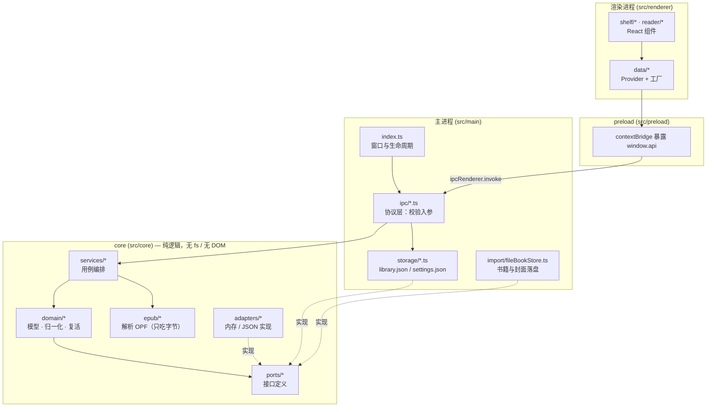
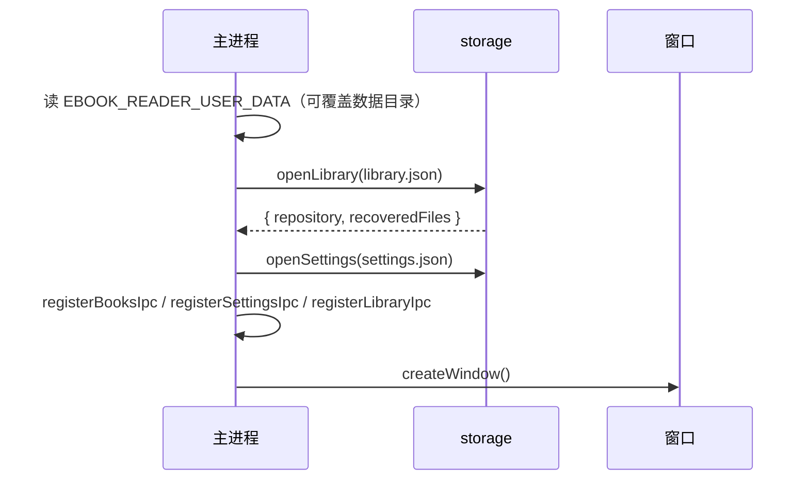
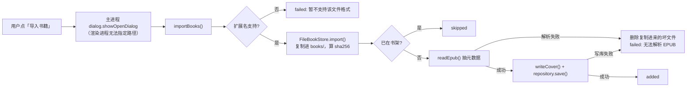
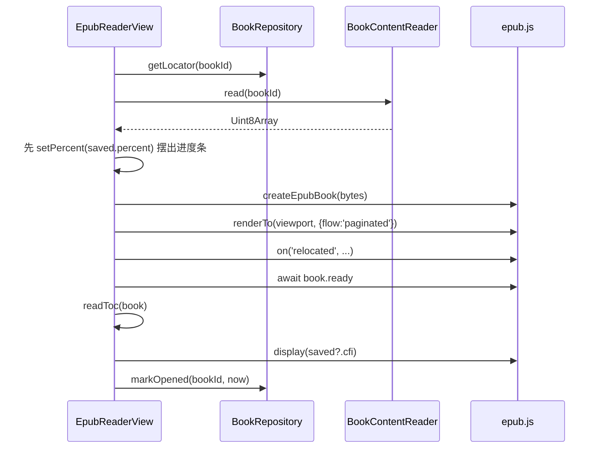
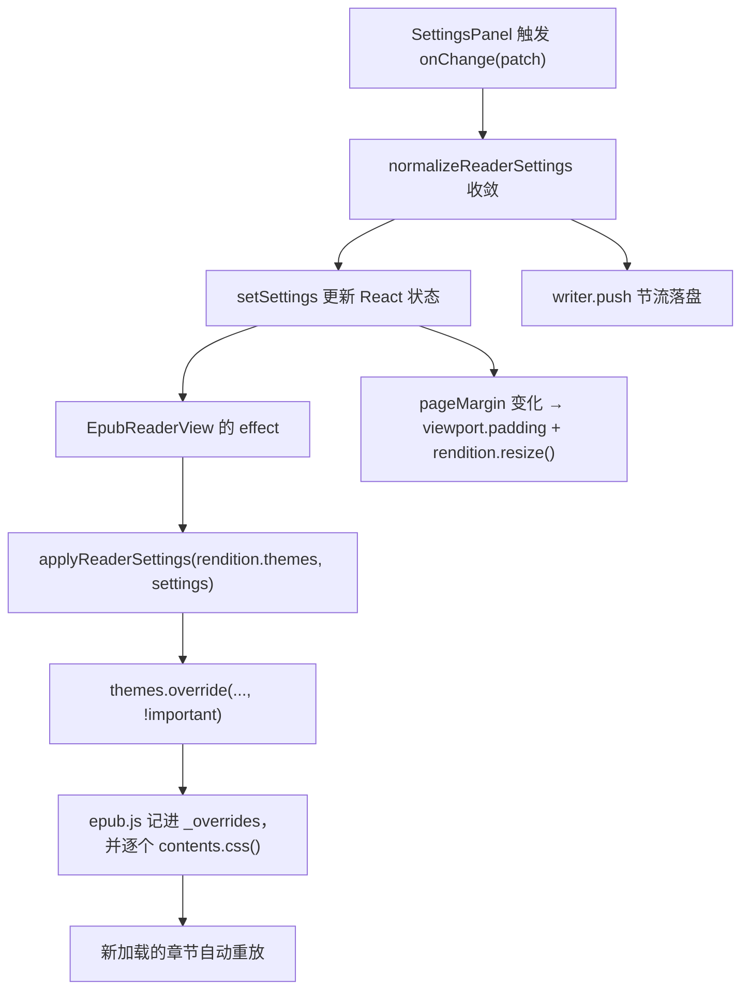
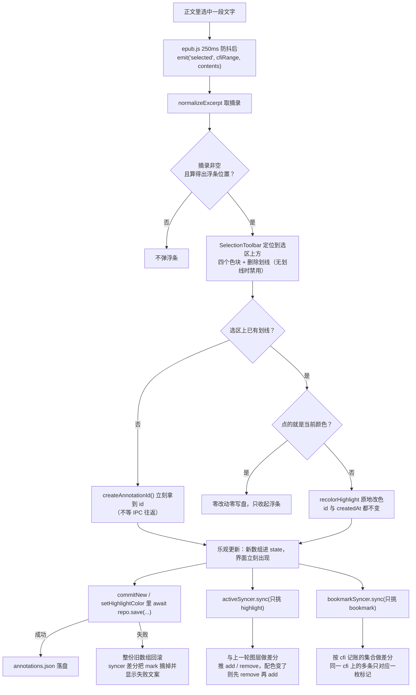
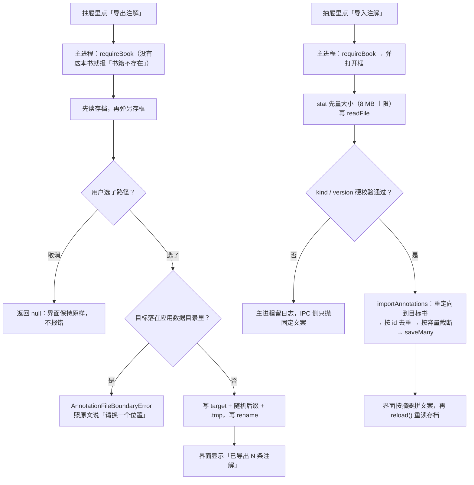
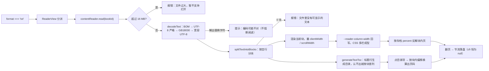

# 电纸书阅读器（MVP）

一个面向 Windows 桌面的 EPUB / TXT 阅读器，用 **Electron + React + TypeScript** 构建。
本文件是项目的总入口：既说明「怎么跑」，也说明「为什么这么写」以及「每一步是怎么走到这里的」。

---

## 目录

- [1. 项目定位与当前状态](#1-项目定位与当前状态)
- [2. 快速开始](#2-快速开始)
- [3. MVP 功能范围](#3-mvp-功能范围)
- [4. 技术选型与理由](#4-技术选型与理由)
- [5. 架构总览](#5-架构总览)
- [6. 核心数据模型](#6-核心数据模型)
- [7. 关键流程](#7-关键流程)
- [8. IPC 契约](#8-ipc-契约)
- [9. 存储布局与容错策略](#9-存储布局与容错策略)
- [10. epub.js 集成要点](#10-epubjs-集成要点)
- [11. 测试体系](#11-测试体系)
- [12. 开发规范](#12-开发规范)
- [13. 迭代历程](#13-迭代历程)
- [14. 已知限制与后续规划](#14-已知限制与后续规划)

---

## 1. 项目定位与当前状态

**定位**：能真正坐下来读完一本书的最小可用版本。不是阅读器的功能演示，而是「导入 → 书架 → 打开 → 读完 → 下次接着读」这条主链路走得通、且数据不会丢。

**当前状态**：MVP 的十个阶段全部完成，验证门禁全绿。

| 指标 | 数值 |
| --- | --- |
| 迭代轮次 | 39 |
| 单元/组件测试 | 71 个文件 / **1038** 个用例，全通过 |
| 端到端测试 | **20** 条 Playwright + Electron 用例，全通过 |
| 类型检查 | `tsc --noEmit` 双工程（node + web）零错误 |
| 一条命令验证 | `npm run verify` |

---

## 2. 快速开始

### 环境要求

- Windows（当前唯一验证过的平台）
- Node.js ≥ 20（开发时使用 v24.21.0 LTS，npm 11.19.0）
- 网络可达 npm registry；安装 Electron 二进制建议走镜像（见下）

### 安装

```powershell
# 国内网络建议走镜像
$env:ELECTRON_MIRROR = "https://npmmirror.com/mirrors/electron/"
npm install --registry=https://registry.npmmirror.com
```

`postinstall` 会执行 `install-electron` 下载 Electron 二进制。

### 命令

| 命令 | 作用 |
| --- | --- |
| `npm run dev` | 启动开发模式（主进程 + 渲染进程热更新） |
| `npm run build` | 构建到 `out/`（main / preload / renderer 三份产物） |
| `npm start` | 预览构建产物 |
| `npm run typecheck` | 类型检查（等于 `typecheck:node` + `typecheck:web`） |
| `npm run test` | 跑全部单元/组件测试（watch 模式用 `npm run test:watch`） |
| `npm run test:e2e` | 先 `build` 再跑 Playwright 端到端测试 |
| `npm run verify` | **交付门禁**：`typecheck` → `test` → `test:e2e` |

> 交付前一律以 `npm run verify` 为准。它失败就等于这次改动没做完。

---

## 3. MVP 功能范围

### 已实现

| 能力 | 说明 |
| --- | --- |
| 导入书籍 | 系统文件选择框（支持多选），复制进应用书库；EPUB 解析书名/作者/封面，TXT 不做元数据抽取、书名用文件名兜底 |
| 内容去重 | 以文件内容 sha256 作为书籍 id，同一本书重复导入只会被跳过 |
| 书架 | 封面网格、书名、作者、进度条、删除（连带回收这本书的 epub、封面、书签与划线）；排序为「最近阅读 → 导入时间倒序 → id」 |
| 分页阅读 | 应用内渲染 EPUB 与 TXT，上一页/下一页翻页 |
| TXT 正文 | 编码按 BOM → UTF-8 严格 → GB18030 回退，按空行分块后用 CSS 多栏分页；进度与阅读设置同 EPUB 共用一套；四级回退都解不干净时给一句非阻断的编码提示 |
| 阅读进度 | 记录 CFI + 全书百分比 + 章节序号，重开应用后回到上次位置 |
| 目录 | EPUB 解析 EPUB 2 NCX 与 EPUB 3 nav；TXT 没有导航文档，改从正文里的「第 N 章」这类标题行现算。抽屉列出层级并支持点击跳转 |
| 阅读设置 | 字号 / 行高 / 页边距 / 主题（白天·护眼·夜间）/ 字体（宋体·黑体），改动落盘并在重启后保持 |
| 书签与划线 | 头部一键加/删书签，书签在正文右侧页边显示竖丝带标记；选中正文弹出浮条，四个色块任选一种划线颜色，选区上已有划线时可原地改色或删除；注解抽屉列出全书书签与划线（带配色名）并支持逐条删除 |
| 注解导出导入 | 注解抽屉里把这本书的书签与划线导出成一份 JSON 文件（默认文件名取书名清洗后的结果），或把另一份这样的文件并进来：一律并到当前这本书、按 id 去重且不覆盖已有、超出容量则截断，结果只说「新增/跳过/丢弃/未导入各几条」，不显示任何路径 |
| 容错 | 书库/注解文件损坏时备份并从空数据启动；设置损坏时静默回落默认值 |

### 明确不做（留给后续版本）

全文搜索、批注、多标签页、云同步、打包分发。TXT 侧不做注解（理由见第 7.9 章）。

---

## 4. 技术选型与理由

| 选择 | 理由 |
| --- | --- |
| **Electron** 而非 Tauri | Tauri 依赖 WebView2，各机器版本不一；Electron 自带 Chromium，`epub.js` 的 iframe 渲染行为稳定可预期。更关键的是它是本项目两条硬规范的支撑点——见下。 |
| **Playwright `_electron`** | 官方支持启动真实 Electron 进程并驱动其中的页面，含 iframe 与主进程 `evaluate`。这让「每次改动都必须配测试」这条规范能落到**端到端**层面，而不只是单测。 |
| **electron-vite** | 一份配置管 main / preload / renderer 三份产物，且 renderer 直接复用 Vite 生态（含 `@vitejs/plugin-react`），单测配置可与构建配置共用别名。 |
| **vitest** | 与 Vite 同源，别名、transform 直接复用；`jsdom` 环境足以覆盖 React 组件与纯逻辑。 |
| **fast-xml-parser** | 解析 OPF / container.xml。刻意把 `parseTagValue`、`parseAttributeValue` 全关掉——EPUB 里的日期、版本号常带前导零，自动转数字会丢信息。 |
| **jszip** | 读取 EPUB（本质是 zip）内的 OPF 与封面图，同样被测试 fixture 复用来**现场生成**测试用电子书。 |
| **epub.js** | 成熟的分页渲染方案，自动处理 CSS 分栏、iframe 隔离与 CFI 定位。 |

### 版本约束（重要）

- `electron-vite@5` 只支持 `vite ^5 || ^6 || ^7`，所以 **vite 必须锁在 ^7**。
- epub.js 不带官方类型，项目用 [epubjs.d.ts](src/renderer/src/reader/epubjs.d.ts) 只声明默认导出，真实形状由 [createEpubBook.ts](src/renderer/src/reader/createEpubBook.ts) 统一描述，避免同一份接口在两处各写一遍后慢慢走样。

---

## 5. 架构总览

### 三层进程隔离



**核心规则：`core` 不许碰 `fs`、不许碰 DOM、不许碰 React。**
这条规则的价值在测试里立刻兑现：[importBooks.ts](src/core/services/importBooks.ts) 这一个用例编排函数，只靠「假的 FileStore + 假的 Repository」就把导入、去重、坏文件清理、书名兜底全测完了，一行真实文件 IO 都不需要。

### 目录结构

```
.claude/agents/         # 项目级子 Agent 定义（格式由 tests/unit/repo 守卫）
src/
  core/                 # 纯逻辑层：可在 Node 与浏览器两种环境下测试
    domain/             #   Book / ReadingLocator / ReaderSettings / TocEntry / Annotation + 归一化与复活
    epub/               #   OPF、container.xml 解析（输入是字节，不碰文件系统）
    ports/              #   接口定义：BookRepository / AnnotationRepository / FileStore / TextStore / ...
    adapters/           #   内存实现与 JSON 实现、快照序列化
    services/           #   用例编排：importBooks
  main/                 # 主进程：窗口、IPC 协议层、落盘实现
    ipc/                #   入参校验 + 调用仓库
    storage/            #   TextStore 的文件实现、书库/设置/注解的打开与恢复
    import/             #   FileBookStore：书籍与封面复制、路径越界防护
    transfer/           #   注解交换文件：字节上限、原子写盘、导出目标目录边界
  preload/              # contextBridge：把 IPC 封装成 window.api
  shared/ipc.ts         # 频道名常量 + AppBridge 接口（主/渲染共用的唯一真相）
  renderer/src/         # React 界面
    data/               #   Provider + 工厂函数（决定用 IPC 还是内存实现）
    hooks/useBooks.ts   #   书架数据流
    shelf/              #   书架与封面
    reader/             #   阅读器（按格式分派）、EPUB 与 TXT 两个正文后端、目录、设置、注解抽屉与浮条、注解 id 生成
    styles/global.css   #   主题变量与全部样式
tests/
  unit/                 # 与 src 同构分层的单元测试
  support/epubFixture.ts# 现场生成 EPUB 的测试夹具
e2e/app.spec.ts         # Playwright + Electron 端到端用例
```

### 别名与双 tsconfig

| 别名 | 指向 |
| --- | --- |
| `@core` | `src/core` |
| `@shared` | `src/shared` |
| `@preload` | `src/preload` |
| `@renderer` | `src/renderer/src` |

类型检查拆成两个工程，**这不是形式主义**：

- [tsconfig.node.json](tsconfig.node.json)：`lib: ["ES2023"]`、`types: ["node"]`、**没有 DOM**。覆盖 main / preload / core / shared / e2e / `tests/unit/main`。
  没有 DOM 意味着 core 层里写 `document` 或 `window` 会**直接编译失败**——架构规则由编译器看管，而不是靠自觉。
- [tsconfig.web.json](tsconfig.web.json)：`lib: ["ES2023","DOM","DOM.Iterable"]` + `jsx: react-jsx`。覆盖 renderer / core / shared / `tests/unit/**`，并 `exclude` 掉 `tests/unit/main`。

两个工程都开 `strict`、`noUnusedLocals`、`noUnusedParameters`、`noImplicitOverride`。

---

## 6. 核心数据模型

### Book —— [src/core/domain/book.ts](src/core/domain/book.ts)

```ts
interface Book {
  id: string            // 文件内容 sha256，天然去重
  title: string         // 空值归一为「未命名书籍」
  author: string | null
  format: 'epub' | 'txt'
  filePath: string      // 书库内的绝对路径
  fileSize: number
  coverPath: string | null
  addedAt: number
  lastOpenedAt: number | null
}
```

- `normalizeBookTitle` 会剥掉控制字符、合并空白、截断到 200 字。
- `compareBooksForShelf` 定义唯一排序：`lastOpenedAt` 降序 → `addedAt` 降序 → `id` 升序。
  **内存实现与 JSON 实现共用它**，因此换实现不会悄悄改变书架顺序。
- `reviveBook` 处理一切外部来源的数据（磁盘存档、IPC 参数）：缺 `id`/`filePath`/`format` 就返回 `null` 让调用方丢弃**这一条**，而不是让整个书库读不出来。

### ReadingLocator —— [src/core/domain/progress.ts](src/core/domain/progress.ts)

```ts
interface ReadingLocator {
  cfi: string | null        // EPUB 定位串
  percent: number           // 全书进度 0~1
  chapterIndex: number | null
  updatedAt: number
}
```

进度估算刻意**不用** epub.js 的 `locations.generate()` —— 那一步要预先扫过整本书，对 MVP 代价太高。改用「章节序号 + 章节内页码」：

```ts
percent = (chapterIndex + pageFraction) / spineCount
```

其中 `pageFraction` 把「第几页/共几页」映射到 `[0,1]`，且首尾页刚好落在章节两端（否则最后一页永远凑不满 100%）。只有 EPUB 章节数拿不到时才退化为单章。

`isSameLocation` 用于过滤滚动过程中产生的大量重复位置，避免每次都写库。

### ReaderSettings —— [src/core/domain/settings.ts](src/core/domain/settings.ts)

```ts
DEFAULT_READER_SETTINGS = { fontSize: 18, lineHeight: 1.7, pageMargin: 32, theme: 'day', fontFamily: 'serif' }
READER_LIMITS = { fontSize: 12~36, lineHeight: 1.2~2.4, pageMargin: 0~96 }
```

`normalizeReaderSettings` 把任何来源的值收敛为合法配置：**越界值夹到边界，非法值回落默认**。所以 `update()` 的入参可以直接来自任何 UI 控件，不必到处写防御代码。

`reviveReaderSettings` 与 `reviveBook` / `reviveLocator` 有个关键差异：**它从不返回 `null`**。因为配置没有「必需字段」，一份残缺配置也能逐字段收敛，调用方不必处理空值分支。

### TocEntry —— [src/core/domain/toc.ts](src/core/domain/toc.ts)

```ts
interface TocItem { id: string; label: string; depth: number }
interface TocEntry extends TocItem { href: string }
TOC_LIMITS = { maxEntries: 500, maxDepth: 4 }
```

- 目录项按「最小共同接口」分层：`TocItem` 只管「抽屉画得出来」的三件事（标识、标签、缩进），EPUB 的 `TocEntry` 加 `href`，TXT 的 `TextTocEntry` 加块序号与块内偏移。抽屉只对 `TocItem` 泛型，两边的载荷它一概不理解、原样透传给 `onSelect`。
- `flattenToc` 把 epub.js 的目录树摊平成带 `depth` 的列表（层级只用来做缩进，树不必再往下传）。
  上限是必须的：畸形 EPUB 能造出几万个目录项。
  没有 `href` 的项无法跳转，**但它的子项仍然有效**，所以跳过自身而不是整枝丢弃。
- `resolveTocTarget` 解决一个真实存在的路径错位：目录里的 `href` 相对**导航文档**，spine 里的 `href` 相对 **OPF**，两者目录不同就对不上号。策略是「先按原样匹配 → 再退回文件名唯一命中 → 都不行就原样返回交给 epub.js 报错」。

### Annotation —— [src/core/domain/annotation.ts](src/core/domain/annotation.ts)

书签与划线共用一个模型：两者都是「书里的一处位置 + 用户附加的信息」，生命周期、存储、列表渲染完全一致，差异只有「有没有选区文本与颜色」。

```ts
interface AnnotationBase { id; bookId; cfi; chapterHref; percent; note; createdAt; updatedAt }
BookmarkAnnotation  = AnnotationBase & { kind: 'bookmark' }
HighlightAnnotation = AnnotationBase & { kind: 'highlight'; excerpt; color }
Annotation = BookmarkAnnotation | HighlightAnnotation
```

- **判别联合，而不是「单结构 + 可选字段」**：书签没有 `excerpt` / `color`，用 `kind` 收窄之后 TS 才拦得住「渲染书签时访问 `color`」这类错误。
- **`cfi` 只以字符串进出 core**，书签是单点（`epubcfi(/6/4!/4/2/2/1:0)`），划线是 range 形式（`epubcfi(/6/4!/4/2,/1:0,/1:10)`）。core 里**不出现 DOM `Range` / `Selection`**：渲染层拿到选区后立刻转成 CFI 字符串再交进来。
- **刻意不校验 CFI 语法**，只做 trim + 非空 + 上限。CFI 的文本断言（`[pre,post]`）里可以合法出现逗号，「含逗号就是 range」这类判据会误杀合法值；语法权威是 epub.js。
- **但长度必须限死（`MAX_CFI_LENGTH = 512`），且超长整条拒绝、不许 `slice`**：截断出来的 CFI 语法无效，会造出一个永远定位不到的注解，比直接丢弃更糟。`normalizeCfi` 从 `progress.ts` 复用，注解自己的上限只加在这一侧——改 `progress.ts` 会波及已存进度。
- **`chapterHref` 比 `toc.ts` 的 `cleanHref` 更严**：它是「存下来下次直接回显」的字段，带 scheme 的绝对 URL（`javascript:` / `data:` / `http:`）一律丢弃。跳转优先用 `cfi`，`href` 只做展示兜底。
- **`id` 由渲染层生成，主进程只校验**：调用方注入 `crypto.randomUUID()`，core 不生成随机 id（对齐 `now: number = Date.now()` 的可注入约定，单测也不必打桩随机源）。渲染层为了做乐观更新不等 IPC 往返，所以这条 id 到主进程时已经在信任边界之外。**但 core 不强制 UUID 形状**，只限死「长度 ≤ 128 + 字符集 `[A-Za-z0-9_-]`」：把 id 钉成 UUID 就等于堵死渲染层在 `randomUUID` 不可用时的回落方案，而真正要防的控制字符、空白、路径分隔符与引号，白名单已经全覆盖。`bookId` 同样限长，`MAX_ANNOTATIONS_PER_BOOK = 1000` 拦住无界增长。回落方案不是纸上预案：[annotationId.ts](src/renderer/src/reader/annotationId.ts) 已经把它落成代码，三档依次降级——`crypto.randomUUID()` → `crypto.getRandomValues()`（`randomUUID` 是安全上下文限定接口，`getRandomValues` 不是，所以这一档正好接得上）→ `Math.random()`。三档都必须随机，**不能退到递增计数器**：同一个 `(bookId, id)` 在存档里是覆盖语义，计数器在「重装 / 换设备 / 清空存档」之后一定会从同一个起点重新走一遍，两条注解会悄悄合成一条。E2E 实测（第 11 章）确认生产环境走的是第一档。
- **`reviveAnnotation` 走的是同一套校验，不是另一套**：与 `reviveBook` / `reviveLocator` 同款，`id` / `bookId` / `kind` / `cfi` 任一非法就返回 `null`，让调用方只丢弃这一条，而不是让整本书的注解都读不出来。id 会被重放，所以复活时长度与字符集要**重新**校验，不能只判非空。

---

## 7. 关键流程

### 7.1 应用启动



`EBOOK_READER_USER_DATA` 这个环境变量是 E2E 测试的基础设施：让每个用例跑在自己的临时数据目录里，既互不干扰，也不会污染用户真实书库。

### 7.2 导入书籍



设计要点：

1. **路径只由主进程产生。** 渲染进程只能说「我要导入」，不能说「读 C:\某处」。即使页面被篡改，也读不到任意本地文件。
2. **单个文件失败不影响其余文件。** 报告里 `added` / `skipped` / `failed` 三个计数分别呈现，每个文件各有一层 `try / catch`。
3. **坏文件要清理。** 复制进来才发现解析不了的文件会被删掉，否则书库目录里会堆垃圾。
4. **写入书库失败也要清理。** 已经复制进来的正文与封面若没能变成书库条目，同样会被回收——否则 `books/` 下会留下一份没人引用、最大 512 MB 的 epub。但删除前必须过两道门：`fileStore.import()` 回报这次是不是真的新建了文件，再加上一次 `repository.get()` 确认这本书确实没进库。少任何一道都可能删掉一本好好的书——去重跳过时文件是别人早先复制进来的，而 `save` 也可能「内存写成功、落盘失败」。
5. **书名兜底**：用源文件名去掉扩展名，比「未命名书籍」有用得多。EPUB 的元数据抽不出来时也走这条兜底。
6. **TXT 不做元数据抽取。** 扩展名认下来就复制进书库、书名取文件名——TXT 没有格式规范，任何「猜书名」的启发式都是在猜，猜错还不如文件名诚实。这也是导入报告里 TXT 永远不会以「无法解析」失败的原因。

### 7.3 打开一本书并恢复进度

[ReaderView.tsx](src/renderer/src/reader/ReaderView.tsx) 本身只是一行分派：`format === 'txt'` 交给 [TxtReaderView.tsx](src/renderer/src/reader/TxtReaderView.tsx)，否则交给 [EpubReaderView.tsx](src/renderer/src/reader/EpubReaderView.tsx)。下面这条链路是 EPUB 通道的，TXT 通道见第 7.9 章。



两个刻意的取舍：

- **等设置读完再排版。** `settings` 为 `null` 时不进入初始化分支。否则会先用默认页边距渲染一次、读到设置后再重排，视觉上明显闪一下。
- **`markOpened` 失败不拦阅读。** 打开时间只影响书架排序，写失败用 `.catch(() => undefined)` 吞掉。

### 7.4 进度与设置的节流落盘

翻页和连点「增大字号」都会产生密集的状态变化，每次都写盘既浪费又没必要。
[throttledWriter.ts](src/renderer/src/reader/throttledWriter.ts) 是**泛型的**节流器，进度与设置都是它的薄封装：

```
push(value):
  与上次已写入的值等价        → 忽略
  与待写值等价                → 忽略
  已有定时器在等              → 直接顶替待写值（不重复排期）
  距上次写入 ≥ minIntervalMs  → 立即写
  否则                        → 排一个 (minIntervalMs - elapsed) 后的定时器

dispose():
  停表 → 把待写值补上 → await 整条写链 → 之后不再接受新值
```

- **写操作串成一条链**（`chain = chain.then(...)`），慢的写不会让后写插队。
- 进度间隔 `500ms`，设置间隔 `250ms`（设置变更远不如翻页频繁）。
- 测试必须注入固定时钟（`now: () => 0`），否则节流窗口内的合并行为无法稳定断言。

### 7.5 打开目录并跳转

`readToc(book)` 只能在 `await book.ready` **之后**调用——那时 epub.js 才把导航解析完。它把 `book.navigation.toc` 交给 `flattenToc` 摊平，再用 `resolveTocTarget` 把每个 `href` 对齐到 spine。

点击条目后调 `rendition.display(entry.href)` 并关闭抽屉。

### 7.6 阅读设置生效



三个关键决策：

1. **页边距交给外层 `.reader__viewport` 的 padding，而不是正文样式。** 因为 epub.js 的分栏排版会给自己设 `body { padding-left/right }`，在那边改会和它的分栏计算打架。容器变窄后还必须显式调 `rendition.resize()`，否则排版停在旧宽度。
2. **所有 override 带 `!important`。** 书内 CSS 常常自带 `font-size` 与颜色，不加优先级盖不住。
3. **主题同时改两处**：`.reader[data-theme]` 上的 CSS 变量（阅读器外壳）与正文的 `color` / `background-color`（书内）。只改一处会出现「外壳黑了但正文还是白的」。

### 7.7 书签与划线



六个关键决策：

1. **id 由渲染层生成，主进程只校验。** 渲染层为了做乐观更新不等 IPC 往返（见第 6 章 `id` 那条），主进程那边这枚 id 已经在信任边界之外，所以 `annotations:save` 会重新校验一遍长度与字符集。
2. **图层同步是差分的，不是每次全清全画。** 每次 `annotations` 变化都 `reset()` 一遍会让整本书的 mark 闪一下，而且 epub.js 的 `annotations.add` 在同一 cfi 上重复添加时会覆盖内部引用、留下孤儿 mark（见第 10 章）。所以 [annotationHighlight.ts](src/renderer/src/reader/annotationHighlight.ts) 记着上一轮的 `Map<id, { cfi, color }>`，只推差分；`reset()` 只允许出现在销毁 rendition 的那段 cleanup 里。
3. **书签是 toggle，划线是「点色块定色 / 原地改色」，删除是独立动作。** 书签在正文右侧页边画一枚竖丝带，头部按钮的文案仍按「当前这页有没有书签」判断；划线浮条的四个色块直接定色，选区上已有划线时同一排色块就是改色入口 —— `recolorHighlight` 改的是同一条注解，id 与 `createdAt` 都不动，因为「删了重划」会在同一 cfi 上换一个 id，而图层按 id 记账、epub.js 的 marks 表按 cfi 索引，两边错位就会留下一枚清不掉的孤儿 mark。点到的正好是当前颜色则零改动零写盘（只收起浮条），与仓储里「删除不存在的 id 不写盘」同一条约定。删除入口是浮条上**常驻**的「删除划线」，没有划线时 `disabled`：常驻而不是按状态换文案，是为了让控件个数恒定、浮条宽度成为常量，定位不会随状态漂移。删除要点两下（选中 + 点按钮），这是刻意的：MVP 没有做「点 mark 直接删」的命中测试。
4. **书签标记是第二个同步器，且按 cfi 记账。** [annotationHighlight.ts](src/renderer/src/reader/annotationHighlight.ts) 里 `createBookmarkMarkSyncer` 与 `createHighlightSyncer` 并列、共用同一个图层、只靠 `type` 字符串（`'mark'` 与 `'highlight'`）隔离。分开而不是合并，是因为两边的记账键、失效判据、`reset` 语义都不同：划线按 id 记账（要处理「改色」这种原地变更），书签按 **cfi** 记账。后者不是随手挑的——epub.js 的 marks 表按 cfi 索引、`mark()` 又幂等，同一 cfi 上的多条书签本来就只对应一枚 DOM 标记；若按 id 记账，删掉其中一条会 `remove(cfi, 'mark')` 把这枚共用的标记摘掉，而幸存那条仍被当成「已经画过」，标记再也补不回来。按 cfi 记账天然得到正确的折叠语义：删到一条不剩时才真正摘掉。
5. **翻页会收起浮条。** `relocated` 时清空选区状态，否则浮条会挂在一个已经不存在的选区上。浮条用 `position: absolute` 落在 `.reader__viewport` 内，位置不是直接拿选区坐标——选区坐标在 **iframe 内部**，必须先补上 iframe 元素相对容器的偏移。算完还有三种收口：上方放不下就翻到选区下方；左右夹在容器内；上下都放不下就落回容器顶部（分栏排版里这是常态，见 [SelectionToolbar.tsx](src/renderer/src/reader/SelectionToolbar.tsx) 的 `fallback`）。
6. **注解抽屉同时承担「跳回原文」和「删除」。** 没有它的话划线划下去就没有任何删除入口，书签的 toggle 也只能在同一页上生效，而且注解列表本身不可见。抽屉里的条目用摘录当按钮文案（没有摘录的划线、所有书签就退化成「百分比 + 类型」），保证不会出现空白按钮。

书签标记的三条实现细节值得单独记一下，它们都是读源码才定下来的：

- **样式写在 [global.css](src/renderer/src/styles/global.css) 而不是正文样式表里。** epub.js 的 `mark()` 产出的 `<a ref="epubjs-mk">` 被 append 到宿主文档的 `.epub-view` 上（**不在 iframe 内**），`rendition.themes.override` 命中不到它。代价是零尺寸元素在写错文件时会静默失效，所以 E2E 用 `toBeVisible()` 把这条钉住。
- **必须 `pointer-events: none`。** epub.js 无条件给每枚 mark 挂 `click` / `touchstart`，不关掉的话页边那条 6px 的丝带会吃掉落到它上面的点击与划选手势。
- **翻页不需要重画。** 标记落在**内容坐标系**里（`.epub-view` 的宽度是整段正文的宽度，翻页只是容器滚动），可见性纯粹由 `.reader__viewport` 的 `overflow: hidden` 裁剪，所以既不需要 `relocated` 钩子、也不会出现「重画 → 触发 relocated → 再重画」的时序风险。这是书签同步 effect 刻意**不把 `position` 放进依赖**的原因：放进去只会让每次翻页都白跑一遍全表差分。

`AnnotationDrawer` 还有一条容易写错的分支：**「读不到存档」和「这本书还没有注解」是两种不同的空态**，前者显示 `ANNOTATIONS_UNAVAILABLE_MESSAGE` 且不显示空态文案，也不能让界面宣称「这本书还没有注解」——那同样是假话（磁盘上可能正躺着一份读不出来的存档）。

失败路径是这一章最值得看的部分：`useBookAnnotations` 的 `commitNew` 把「构造 + 写本地列表 + 落盘」整段包在同一个 try/catch 里（core 的工厂是 throw 语义，`save` 本身也会 reject，两者落到同一句失败文案上），`catch` 里**只做回滚**——不写状态、不发第二条 IPC、不重复上报。因为 `annotations:save` 的失败已经在主进程侧明确化了（见第 9 章的 `UnavailableAnnotationRepository`），渲染层再补一刀只会造出第二条失败路径。回滚时恢复的是**整份旧数组**，不是「把刚加的那条删掉」：`save` 内部是整份替换语义，两次操作并发时 pop 掉的可能是另一条，所以回滚也只能是整份替换。正文上的 mark 不需要在 `catch` 里手动清——`annotations` 一变，同步 effect 的差分自然把它摘掉。

---

### 7.8 导出与导入注解



七个关键决策：

1. **交换用的两个频道独立成组。** `ANNOTATION_TRANSFER_CHANNELS` 与 `ANNOTATION_CHANNELS` 分开，虽然注册在同一个 `registerAnnotationsIpc` 里（它们共用同一份 id 校验与同一个仓储，拆两个注册函数只会让「注册的频道集合」那条断言失去意义）。分开的理由是信任假设不同：那三个是「一条一条的增删查」，这两个是「整本书的一份文件」——要弹系统对话框、要按用户给的路径读写任意位置。
2. **摘要只带计数，一个路径都不回传。** `ExportAnnotationsSummary { count }`、`ImportAnnotationsSummary { added, skipped, dropped, trimmed, fromOtherBook }`，与 `BookImportSummary` 同款。用户刚在系统对话框里亲手选的路径不需要应用再念一遍；这样「渲染进程只能拿到 `bookId`」就是结构性成立的，而不是靠对话框实现替我们保证。界面只串非零片段（`新增 2 条；跳过 1 条（本机已有）`），一条都没有时才说「文件里没有可导入的注解」。
3. **导入一律重定向到「当前这本书」。** 文件里的 `book.id` 只作参考，条目全部按 `bookId` 归到打开抽屉的那本书上；与目标书已有注解同 id 的以**本机为准**、计入 `skipped`，绝不覆盖；整个流程**只增不删**。这也是「导入到另一本书」这种需求在本版干脆不做的原因——重定向的语义一旦有了例外，用户在界面上就无从判断自己会覆盖什么。
4. **导出只挡「应用自己的数据目录」。** 默认目录是文档目录，但用户完全可以手动把另存框的路径改到应用数据目录里——那不叫导出，那叫拿一份手改过的文件覆盖应用自己的存档，被覆盖的是用户全部的笔记。`writeAnnotationText` 的 `requireOutside` 因此只认这一条边界（含「目标就是 root 本身」），别处一律不设限。
5. **两种失败必须分开说。** 「文件挑错了」重试一万次也没用，「导入失败」多半重试一次就好，糊成一句话等于把用户往错的方向推。所以 `ANNOTATION_FILE_INVALID_MESSAGE` 与 `ANNOTATION_EXPORT_BOUNDARY_MESSAGE` 放在 [src/shared/ipc.ts](src/shared/ipc.ts)，主进程抛、渲染层按 `includes` 认出原文，两边必须逐字一致；具体原因（版本太新、不是 JSON）只在主进程留一条日志——IPC 传递会把 message 拼上一长串内部前缀，不适合直接给用户看。
6. **空列表时导出按钮 `disabled` 而不是隐藏。** 按钮还在，用户就知道这个能力存在，只是现在没东西可导；`hide` 掉会让人以为导出功能没做。导入按钮则永远可点——空书里导入注解正是一个完全正常的用法。整个「导出 / 导入」那一行只在有交换能力时渲染（`canTransfer`），浏览器预览里 `createAnnotationTransfer()` 返回 `null`。
7. **导入成功后 `reload()` 重读存档，不在渲染层把条目并进本地列表。** 主进程那边同时在按 id 去重、按容量截断，在渲染层照着推算一遍等于把同一套规则写两处，迟早走散。重载走的是**不清空列表**的那条路径：清一下会让抽屉闪出「还没有书签或划线」，而这句话在那一刻是假的。

导出前先读存档（再弹另存框）不是随手排的顺序：反过来在降级会话里会白弹一次框，用户精心挑完路径才被告知存档根本读不出来。这个顺序还有个副作用——空列表照样能导出一份合法文件，这是有意的，用户想留个空档案我们也拦不着。

导出走「先临时文件再改名」，与存档同款，但临时文件带**随机后缀**：同一本书连点两次导出，两个写盘过程会互相覆盖同一个 `.tmp`，最后 rename 出来的内容可能来自另一次导出。失败的清理用 `rm(tmp, { force: true }).catch(() => undefined)`——临时文件删不掉只是一点垃圾，原始错误才是用户需要看到的那一个，清理失败绝不能把它盖掉。

8 MB 的导入上限（`MAX_ANNOTATION_FILE_SIZE`）落在 [annotationFile.ts](src/main/transfer/annotationFile.ts) 而不是 core：core 不得碰 fs，连 `stat` 都做不了，没有位置能拦住 `readFile`。先 `stat` 再 `read` 而不是读回来再量长度——上限的意义就是「别把一个 G 的文件读进内存」，读完才知道超了就已经白读了。

另存框的默认文件名由 `annotationFileName(book.title)` 给出：书名来自可改的书库文件，完全可能是 `三体/全集` 这种在 Windows 上存不下去的名字，所以非法字符换空格、合并连续空白、掐掉结尾的点和空格（Windows 会静默丢掉它们，剩下的 `defaultPath` 和实际存下的路径对不上号），再限长 60 字符并**再掐一次尾**（截断后第 60 个字符正好落在分隔符上时，第一轮的规则已经跑过了）。洗完什么都不剩就回落 `未命名书籍-注解.json`，绝不让 `defaultPath` 变成 `.json`。

### 7.9 TXT 正文通道



设计要点：

1. **正文后端各写各的，只共用外壳。** 两个后端共享 [ReaderChrome.tsx](src/renderer/src/reader/ReaderChrome.tsx) 的头部、进度条与翻页按钮，正文那块没有任何共同点：TXT 没有 cfi、没有注解图层，分页还得自己量。强行抽成同一个接口，换来的是一堆「某一边用不上」的可选字段；分派放在 `ReaderView` 里，两边各自的状态与副作用也不会跑到对方身上。
2. **没有第二套进度模型。** 块就是 TXT 的「章节」：`chapterIndex` 取块序、`spineCount` 取块数、块内第几栏就是 `page`。于是 [progress.ts](src/core/domain/progress.ts) 的 `locatorFromRelocation` / `percentFromRelocation` **一行都不用改**，书架进度条、已读完判定、节流落盘器也全部照旧复用。代价是 `cfi` 恒为 `null`。
3. **续读只能反解，且反解必须用同一帧量出的栏数。** 只按 `chapterIndex` 打开会落在块首，用户看到的是「读了一半、重开退回块开头」，所以由 `percent` 反算块内页（`blockPageFromLocator`）。这里有个必须踩过才知道的坑：分栏数是**量**出来的，而布局状态要到下一次渲染才更新——在另一个 effect 里读 `layout.totalPages`，读到的是首帧那个恒为 1 的旧值，反解永远给出块首。所以反解写在量宽度的那次 `useLayoutEffect` 里、直接用本次算出的局部变量，并加一条 `layout.columnWidth > 0` 的守卫：首帧 `--reader-column-width` 还是 `auto`，量到的是单栏普通流，同样不能用。反解出来的页码还要再 `clampPage` 一次（改字号会让总页数变少），所以顺序是「先反解、后夹取」。
4. **编码回退顺序是确定的四级。** BOM 优先（文件自己声明的编码比任何启发式可靠）→ `fatal` 的 UTF-8（解不开就说明不是 UTF-8，而不是「解出乱码」）→ GB18030（覆盖 GBK/GB2312，中文 Windows 的默认码页）→ 非 `fatal` 的 UTF-8（坏字节变 U+FFFD，绝不抛异常）。不做 NUL 密度启发式：没有 BOM 的 UTF-16 在实践中不存在（记事本一定会写 BOM）。换行归一化刻意**不**放在解码里——那是 `splitTextIntoBlocks` 的职责，两处都做会让「空行分段」有两个实现。
5. **分页靠 CSS 多栏，栏宽自己量。** `column-fill: auto` 让内容先填满一栏再开下一栏，超出的栏溢出到容器右边被 `overflow: hidden` 裁掉，于是 `scrollWidth` 正好等于全部栏的总宽；栏间距取页边距的两倍，让栏间留白等于四周边距。页边距放在视口层、正文层是纯内容盒，量出来的 `clientWidth` 直接就是一栏该有多宽，不必再减 padding。分页算术抽成 [textPagination.ts](src/renderer/src/reader/textPagination.ts) 的纯函数——jsdom 里 `scrollWidth` / `clientWidth` 恒为 0，留在组件里就只剩「文本渲染出来了」可断言。
6. **两道容量闸，超了直接说不。** 字节上限 16 MB（UTF-8 中文约合 500 万字）挡在解码之前，单块上限 20 万字符挡在排版之前。EPUB 是 epub.js 流式处理的，TXT 却要一次解码成字符串再排版，不设闸就是把渲染进程打满。
7. **TXT 不开放注解，而且明说。** 没有 cfi 这类稳定锚点，标注定位不回原文；抽屉里给一句「TXT 书暂不支持注解：没有 cfi 这类稳定锚点，标注没法准确定位回原文」，而不是列一个空列表——说清为什么没有，比让人以为「这本书恰好没笔记」诚实。因此 TXT 侧没有书签按钮；目录按钮则按「有没有目录项」置灰（见第 7.10 章）。

### 7.10 TXT 的目录生成与编码提示

EPUB 把目录写成 NCX / nav 文档，TXT 什么都没有——这两件事都是「TXT 拿不到现成结构，只能从正文里推」的补课。

**目录：从标题行现算。**

1. **只认整行的标题，不认句子中间的那几个字。** 判据是整行匹配、且标题正文不超过 20 字。两道闸合起来才敢叫「标题」——只要「包含第一章」就算，正文里「他翻到第一章就睡着了」会被判成标题；反过来把长度放宽，一整段叙述都会被收进来。模式本身由 `CN_NUM` / `ROMAN_NUM` / `CN_UNIT` 三个常量拼装，覆盖「第 N 章/节/回/卷/篇/部/集/话/幕」（序号支持阿拉伯数字、中文数字与罗马数字）、后置写法（「卷五」「章三」）、英文 `Chapter N` / `Part N`，以及序章、楔子、前言、终篇这类不编号的开头。
2. **纯编号行单独一条规则，而且要多加两道闸。** `01. 起点`、`2、转折`、`三：归途`、`4 终局` 这类排法在 TXT 里很常见，但它们的形状和页码、年份、列表项完全一样。所以 `NUMBERED_LINE` 要求序号后面必须跟分隔符（`.`、`、`、`：`、空格）**且**标题正文非空——光秃秃一个 `01` 或 `2024` 不算标题。两条规则各扫一遍再按块内偏移合并去重，同一行被同时认到只出一条。
3. **一个块里可能有多个标题。** 中文 TXT 的章节之间常常只换行、不空行，于是整本书会是一个块（块按空行切）。如果只认块首，一本书就只有一个目录项。所以这步在**块内**跑 `matchAll`，支持一个块里出现多个标题。
4. **坑：带 `/g` 的正则挂在模块级会留下状态。** `exec` 循环配合 `lastIndex`，中途 `break` 或提前返回都会把 `lastIndex` 留在上一次的位置，下一次调用从半路开始扫。改用 `matchAll`——它每次克隆一份正则，原正则的 `lastIndex` 恒为 0，没有可残留的状态。
5. **认不出标题就退化成按块首列，而不是给一个空目录。** 目录项标签取块首 200 字符折叠成一行，空块首用「第 N 块」占位。这条路不完美，但比「这本书没有提供目录」有用：至少还能按段跳。（也正因如此，目录按钮只有在**一个块都没有**时才置灰。）
6. **跳转要落在标题那一行，不是块首。** 目录项记的是块序号 + 块内偏移；偏移乘块长摊到栏数就是页码（`blockPageFromOffset`，与反解进度用的是同一套算术）。同一个块里的第二个标题，落点自然是块的中段。
7. **坑：跳到当前这一块时，什么状态都不变。** 块序号没变、页码没变、栏宽没变——量宽度的 `useLayoutEffect` 一个依赖都没动，于是不会重跑，偏移永远换算不出来。所以另加一个自增的 `jumpSeq` 计数器当依赖，专门用来「把 effect 叫醒」。

**编码提示：兜底解码是猜的，猜错了要说。**

7. **判据是「解出来的正文里有替换字符 U+FFFD」。** 宽容解码 `new TextDecoder(label)` 默认 `fatal: false`，解不出的字节必然变成 U+FFFD，所以「有没有 U+FFFD」基本等价于「有没有坏字节」。代价是输入正文本身就含 U+FFFD 时会多报一次——约千分之一的概率，不值得为它加第二级判据（已用一条用例把这个已知的多报钉住）。
8. **实测生效的编码标签一起回报。** `decodeText` 返回 `{ text, encoding, uncertain }`，`encoding` 是真正起作用的那一档（utf-8 / utf-16le / utf-16be / gb18030），不是「猜的是哪个」。原来的 `decodeTextBytes` 保留成薄包装，免得十个只断言字符串的旧用例全体改成 `.text`。
9. **提示是提示，不是错误。** 编码可疑照样把正文渲染出来，只在头部下面加一行弱化的 `role="status"`：能读的字节继续读，读不了的字节用户知道为什么。文案刻意不写「请另存为 UTF-8」——那是把一个我们猜不出来的问题丢给用户去解决。加载中与打开失败时都不显示（提示只对「已经解出来的正文」有意义）。

---

## 8. IPC 契约

频道的字符串**只在** [src/shared/ipc.ts](src/shared/ipc.ts) 里定义一次，主进程与 preload 都从这里引用，避免两边各写一份字符串写错。

| 分组 | 频道 | 入参 | 返回 |
| --- | --- | --- | --- |
| `books` | `books:list` | — | `Book[]` |
| | `books:get` | `id` | `Book \| null` |
| | `books:save` | `Book` | `void` |
| | `books:remove` | `id` | `void` |
| | `books:get-locator` | `bookId` | `ReadingLocator \| null` |
| | `books:save-locator` | `bookId`, `ReadingLocator` | `void` |
| | `books:mark-opened` | `id`, `openedAt` | `void` |
| `library` | `library:import` | — | `BookImportSummary \| null`（取消为 `null`） |
| | `library:read-cover` | `bookId` | `BookCover \| null` |
| | `library:read-content` | `bookId` | `Uint8Array \| null` |
| `settings` | `settings:load` | — | `ReaderSettings` |
| | `settings:save` | `ReaderSettings` | `void` |
| `annotations` | `annotations:list` | `bookId` | `Annotation[]` |
| | `annotations:save` | `Annotation` | `void` |
| | `annotations:remove` | `bookId`, `annotationId` | `void` |
| `annotations`（交换） | `annotations:export` | `bookId` | `ExportAnnotationsSummary \| null`（取消为 `null`） |
| | `annotations:import` | `bookId` | `ImportAnnotationsSummary \| null`（取消为 `null`） |

**协议层的职责是校验，不是转发。** 所有 handler 先跑一遍 `reviveBook` / `reviveLocator` / `reviveAnnotation` / 类型检查，非法数据直接抛错，绝不写进用户书库。

`AppBridge.annotations` 刻意用 `Pick<AnnotationRepository, 'listByBook' | 'save' | 'remove'>` 而不是另写一份声明，端口改了这里会跟着编译报错。摘掉的两个方法各有理由：

- `load()`：主进程在启动时就预读过存档，渲染层再读一次只会覆盖主进程的降级决定。
- `removeByBook()`：删书必须先删书、后删注解，这个顺序只有主进程知道；暴露给渲染层等于给「书还在、划线没了」开了个口子。渲染层的适配器（`createAnnotationRepository`）调用它会直接 reject。

`AppBridge.annotationTransfer` 直接引用 core 的 `AnnotationTransfer`，只有两个方法、**两头都不带路径**：`exportBook(bookId)` 与 `importInto(bookId)` 的入参只有 `bookId`，返回的只有计数摘要。对话框在主进程弹、文件在主进程读写，渲染进程既不能指定路径也拿不到路径。这两个频道比那三个多两道闸：`requireBook` 先确认 `bookId` 指向书架上真实存在的书（否则注解会写进一份没有任何界面能列出来的孤儿存档，用户以为导入成功了，实际什么也看不到），出口则是 `readAnnotationText` 的字节上限与 `writeAnnotationText` 的目录边界。

新增频道时必须三处同步（[src/shared/ipc.ts](src/shared/ipc.ts)、`src/main/ipc/*Ipc.ts`、[src/preload/index.ts](src/preload/index.ts)）。

窗口配置：`contextIsolation: true`、`nodeIntegration: false`。渲染进程只能看到 `window.api` 这一个受控接口。

### 渲染进程如何选择实现

`data/create*.ts` 里的工厂函数统一用同一个模式：

```ts
const bridge = typeof window === 'undefined' ? undefined : window.api
return bridge?.books ?? new InMemoryBookRepository()
```

**有 IPC 桥就持久化，没有就退化成内存实现。** 这样纯浏览器预览与单元测试都能把 UI 完整跑通。

`createAnnotationTransfer()` 是这条规则的一个例外：它返回 `AnnotationTransfer | null`，没有桥时给 `null` 而不是「支持但每次调用都失败」。导出导入的每一步都要由主进程弹系统对话框，浏览器里根本无从做起，给一个点了没反应的按钮比直接不显示还糟——界面拿到 `null` 就整块隐藏这两个入口（`canTransfer`）。`AnnotationTransferProvider` 的上下文初值是 `undefined` 而不是 `null`，两者语义不同：`undefined` 是「没人注入，去探测一下」，`null` 是「确实没有这个能力」。

---

## 9. 存储布局与容错策略

```
<userData>/
  library.json                        # 书库：书籍数组 + 进度表
  settings.json                       # 阅读设置
  annotations.json                    # 注解存档：书签与划线数组
  books/<sha256>.<ext>                # 书籍副本，文件名即内容摘要
  covers/<bookId>.<ext>               # 抽取出的封面
```

**注解为什么不进 `library.json`**：`library.json` 是「每本书一个进度值」的表，而注解是集合。混在一起会让每次翻页保存进度都得重写全部划线，而且一份坏掉的划线会连带把书库一起判为损坏。代价是注解与书库是两把独立的锁、跨文件没有事务，所以「删书 + 删注解」必须在主进程同一个 handler 里顺序完成。这两条存档的恢复流程**刻意各写一份**，不复用：[annotations.ts](src/main/storage/annotations.ts) 的备份路径只从传入的 `filePath` 派生，**不硬编码文件名**；且它只认 `AnnotationCorruptError`，遇到 `LibraryCorruptError` 或 IO 失败一律原样抛出，绝不会把书库的损坏当成注解损坏去备份。这条隔离由 [annotationStorageIsolation.test.ts](tests/unit/repo/annotationStorageIsolation.test.ts) 双向钉住（`annotations.ts` 不含 `/library/i`，`library.ts` 不含 `/annotation/i`）。

仓储层另有一条写盘约定：`remove` 删一个不存在的 id、`removeByBook` 一条都没删到，都**不落盘**。删除是幂等的，重试不该把存档文件的修改时间反复刷新，也不该因为删掉一本没有注解的书就凭空造出一个空存档文件；`save` 是 upsert，命中同一条就是真的改内容，照常写。

JSON 仓储还有一条更硬的约定：**落盘失败就回滚内存**。`JsonBookRepository` 的四条写操作（`save` / `remove` / `saveLocator` / `markOpened`）都是先改内存、再 `flush`。`flush` 失败时若把改动留在内存里，就会出现「这次调用抛了错，可内存里已经是改完之后的样子」的分裂：调用方按失败处理，之后再读到却是一份磁盘上并不存在的状态，重启后凭空消失。所以失败的那一次改动必须原样撤掉——而且**只撤这一次**，不用整表快照（`saveLocator` 每次翻页都会触发，快照一份 `Map` 太贵），每个操作自己记住要还原的那一两项即可。`remove` 要同时还原书籍与进度，因为进度表里也有这本书。

「删书 + 删注解」落地后还多了一条降级约定：**注解没清干净不算删书失败**。书库条目已经删掉、磁盘也改了，这时候再把 `removeByBook` 的失败抛回渲染层，只会让界面宣称「删除失败」，而用户重试也删不掉一本已经不存在的书。所以主进程只留一条日志，把这份孤儿注解留在存档里——它对应的书已经不在书库，界面永远读不到它。风险留在主进程日志里，比骗用户去重试一件已经完成的事要小。

回收磁盘文件时这条降级约定被复用到了 `FileStore` 上，并且顺序被钉得更死：`get` 取路径 → `repository.remove` → `removeByBook` → 删 epub → 删封面。取路径必须在 `remove` 之前，因为 `remove` 之后存档里就没有这本书了，`filePath` 与 `coverPath` 也跟着没了。这一步之后的两条收尾都是尽力而为：删了文件但书还在书库里会留下「书架上有条目、点开读不了」的坏状态，比占盘严重得多，所以文件回收必须排在所有数据落定之后；而回收失败不抛回渲染层，因为 `library.json` 是用户可改的明文，`filePath` 完全可能被改成一个越界路径，抛出去只会让用户看到一次假的删除失败。epub 与封面各自独立收尾，封面删不掉不该妨碍回收更占地方的 epub。

**失败留痕按性质分级**，而且默认是重的：判不出来的一律 `console.error`，只有少数「预期之内」的情形才降为 `console.warn`。降级名单是封闭的——文件系统层面只认 `EBUSY` / `EACCES` / `EPERM` / `ENOENT` / `ENOSPC`（Windows 上文件被占用是常态），再加一条「注解仓储当前不可写」（启动期降级后它抛出的消息取自导出的 `ANNOTATIONS_UNAVAILABLE_MESSAGE`，比较的是常量而不是源码里复写一遍的中文）。分级的动机很实际：一律 `warn` 会让「存档被改坏」和「文件正被别的进程占着」长得一模一样，而这两件事的处理方式完全不同。边界错误（`FileStoreBoundaryError`）和没有 `code` 的普通 `Error` 都归到 `error` 那一档。

`FileStore` 为此补了一个独立的 `removeCover(bookId, coverPath)`，而不是给 `remove` 加一个「这条路径算哪类目录」的参数。越界校验的依据只能由实现自己决定——调用方用一个参数指定「按哪条根目录校验」，等于把安全边界的裁决权交了出去。封面与书籍分属两个目录，两个方法各自持有自己的根目录，也顺带挡住了「把封面路径交给 `remove`」这类串用。

两个方法都要传 `bookId`，因为「在库内」还不够，还得是**这本书**的文件。越界校验挡的是「跑到书库外面去」，挡不住「跑到同一目录里别人的文件上」：`library.json` 是可改明文，把 A 的 `filePath` 写成 `books/<B 的内容摘要>.epub`，几项路径检查全部通过，删掉的却是 B 的正文，而 B 还留在书架上打不开——正是这套收尾最想避免的坏状态。归属只能靠落盘命名约定判断（`books/` 下是 `<内容摘要>.<格式>`，`covers/` 下是 `<bookId 剔除路径危险字符>.<图片格式>`），而这份约定只有 `FileBookStore` 自己知道，所以校验就放在实现里当方法的不变量：文件名不以「这本书的标识 + `.`」开头就直接拒绝。用前缀而不是拼出完整文件名，是因为扩展名由输入格式与图片格式决定，硬编码一份扩展名清单迟早会和 `copyIn` / `writeCover` 走散。

收尾用的 `rm` 永远不带 `recursive`，也不先用 `stat` 预判类型。不带 `recursive` 时若目标是个目录会抛 `ERR_FS_EISDIR` 且内部文件完好，所以存档被改坏成一条指向目录的路径，最坏只是删不掉，不存在连整棵子树一起删的可能——这条约束比任何预判都可靠，因为失败方向是安全的。

数据目录由 `app.getPath('userData')` 决定，可用环境变量 `EBOOK_READER_USER_DATA` 覆盖。

### 写盘：先临时文件再改名

[FileTextStore](src/main/storage/fileTextStore.ts) 与 [FileBookStore](src/main/import/fileBookStore.ts) 都采用 `写 .tmp → rename` 的原子替换。中途被强杀也不会留下半个 JSON 把书库彻底读坏。

### 读盘：两套不同档次的容错

| 文件 | 损坏时的行为 | 理由 |
| --- | --- | --- |
| `library.json` | **备份**为 `library.json.corrupt-<时间戳>`，以空书库启动并 `console.warn` | 书库是用户数据，不能删；同时应用必须永远能起来 |
| `settings.json` | 静默回落默认配置，**不留备份** | 配置读不出来不值得中断启动，也不值得留垃圾文件 |
| `annotations.json` | **备份**为 `annotations.json.corrupt-<时间戳>`，以空存档启动 | 划线是用户自己敲出来的内容，属于用户数据，不能删 |

`library.json` 与 `annotations.json` 的解析都是**宽容**的：整份文件不是合法 JSON / 根节点不是对象才算「损坏」（分别抛 `LibraryCorruptError` 与 `AnnotationCorruptError`）；单条记录坏了只丢弃那一条并计入 `dropped`。没有对应书籍的进度被当作垃圾数据丢弃，避免无限增长；注解存档独立成档，没有 `books` 数组，也就没有「孤儿记录」那一档。

**`dropped` 是三种原因的合并计数**，两边同义：[ParsedLibrary](src/core/adapters/librarySnapshot.ts:38) 把「书籍字段非法」「孤儿进度」「进度字段非法」加在一起，[ParsedAnnotations](src/core/adapters/annotationSnapshot.ts:71) 把「注解字段非法」「同一 `(bookId, id)` 重复」「超出上限被裁」加在一起。其中「孤儿进度」与「超限裁剪」**不是数据损坏**，而是有意的回收，所以这个数偏大并不等于存档有问题。它现在只有测试在读（两个仓储的 `ensureLoaded` 都直接丢弃），界面真要区分「数据坏了」和「正常回收」，得先把这个数拆成明细。

注解的恢复流程与书库的**刻意不共用**，且比它多一道守卫：备份用的 `rename` 失败时（Windows 上文件被占用是常态）**跳过那次重读**。磁盘上躺着的仍是那个坏文件，再读一次必然二次抛错，而 `openAnnotations` 里没有 `catch` 兜住它。书库那边的恢复流程正是踩在这个点上：一旦 `rename` 抛错，`openLibrary` 会把 `LibraryCorruptError` 二次抛出去——它注释里那句「备份失败不应阻止应用启动」并没有做到。[library.ts](src/main/storage/library.ts) 刻意不动这个逻辑（改了要重新论证一遍书库的恢复语义），这个洞改由下面的启动层兜住，并由 [startup.test.ts](tests/unit/main/startup.test.ts) 直接钉住「`openLibrary` 会抛、启动层仍然给得出可用书库」。`recoveredFiles` 的语义两边保持一致：只表示「这次是救回来的启动」，不表示备份真的成功。

### 启动期：读不出存档也能起来

[openStorageForStartup](src/main/storage/startup.ts) 把上面两道容错包在一起，**任何情况下都返回可用对象，从不抛错**。它在启动链上的位置见 [src/main/index.ts](src/main/index.ts)。

| 情形 | 行为 | 落盘吗 |
| --- | --- | --- |
| 正常 / 文件不存在 | 用 JSON 仓储（懒加载） | 落盘 |
| 存档**损坏** | 由 `openLibrary` / `openAnnotations` 备份改名后以空存档启动 | 落盘（写的是新文件） |
| 存档**打不开**（路径被目录占住、权限不足、被占用） | 书库回落内存实现；注解回落 `UnavailableAnnotationRepository`（四个数据方法一律失败）。各自记一条 `console.warn` | **不落盘** |

第三档为什么不能是「拿同一套 JSON 仓储再试一次」：那个仓储刚在 `openAnnotations` / `openLibrary` 里连 `load()` 都没走通，`loaded` 永远停在 `false`，接下来的每一次读写都会重新抛同一个异常——等于整场会话的功能全废。这一条只解决了「不抛错」，没有解决「用户以为存下来了」。

于是注解这一半改用 [UnavailableAnnotationRepository](src/main/storage/unavailableAnnotationRepository.ts)：**四个数据方法一律 reject**，`load()` 是唯一保持 resolve 的方法（它在桥接实现里本来就是空操作，且在启动链上没有调用方，不该给启动链引入一个可能被忽略的 rejection）。原因是内存实现留下了一条真正危险的路径：它的 `save` 会 resolve 并在内存里留下副本，于是渲染层的乐观更新一路走通、界面如实显示「已保存」，而磁盘上什么都没有——用户关掉应用就丢掉了整个会话的标注，全程没有任何提示。这是唯一一条「界面说存了、磁盘没有」的真实路径，**渲染层权限内没有任何办法察觉到它**，只能由主进程在源头把写入变成明确失败。

读也一起失败是有意为之：`listByBook` 返回空数组会让界面宣称「这本书还没有注解」，那同样是假话（磁盘上可能正躺着一份读不出来的存档），还会把用户引向「重新标一遍」，可重新标一样会失败。四方法装死之后，整个功能一致地表现为「本次会话用不了」，渲染层只要走它本来就有的失败与回滚路径即可。

书库那一半**暂且保留内存实现**：这是同一类问题（`InMemoryBookRepository.save` 同样会 resolve），但它的影响面是书架列表而不是阅读界面，留给后续单独处理，免得一次改动同时动两套界面行为。

两种回落都保证磁盘上那份文件一个字节都不会动（[startup.test.ts](tests/unit/main/startup.test.ts) 逐字节钉住了这一点）。

两个存档**各自独立降级**：注解读不出来不影响书库落盘，反之亦然。降级不是静默的，每条都会在控制台留下能区分「书库」和「注解」的警告。

启动链最后还有一道 `catch`：走到那里说明已经不是存档问题（注册 IPC、建窗口失败），此刻没有可降级的余地，于是弹一个看得懂的 `showErrorBox` 再退出，而不是留下一个没有窗口、用户也杀不掉的进程。

### 路径越界防护

`FileBookStore` 所有按路径操作的接口都先过 `resolveInside`：解析后的绝对路径必须以书库目录为前缀，否则一律拒绝。即使书库存档被手工篡改成 `filePath: C:\Windows\...`，也读不出书库以外的文件。

**唯一一处按用户给的路径写文件的地方是注解导出**，它用的是另一套校验 `requireOutside`：目标既不能落在应用数据目录内，也不能就是它本身（`<userData>` 与其下所有路径一并拒绝），别处一律放行——导出到用户自己挑的位置正是这个功能的意义所在。两套校验的根目录方向相反，也刻意不复用：书库那边是「只许在里面」，交换文件这边是「只许在外面」，把它们合成一个带开关的函数，迟早会有人传错那个开关。

### 文件大小限制

单本书上限 512 MB（`MAX_BOOK_FILE_SIZE`），防止误选超大文件把内存打满。空文件也会被拒绝。

导入的注解文件上限 8 MB（`MAX_ANNOTATION_FILE_SIZE`）。注解本身很小，到这个量级只可能是选错了文件（整本电子书、视频），提前拦住比读进来再失败友好。

---

## 10. epub.js 集成要点

这些是读源码 + 实测确认的行为，改动阅读器前值得先看一遍：

| 事实 | 影响 |
| --- | --- |
| `book.navigation` 是**同步属性**（`Navigation` 实例），`book.loading.navigation` 才是 Promise | 必须 `await book.ready` 之后再读目录 |
| `navigation.toc` 元素形状为 `{ id, href, label, subitems, parent }`，NCX 与 EPUB 3 nav 产出同形；无导航时是 `[]` | `flattenToc` 只需处理一种形状 |
| `book.destroy()` 会把 `navigation` 置为 `undefined` | 卸载顺序要先 `rendition.destroy()` 再 `book.destroy()` |
| `rendition.display(href)` 支持带 `#fragment` 的 href，但**只跳到该章开头** | MVP 不做段内精确定位 |
| `themes.override(name, value, priority)` 写进 `_overrides`，并对当前每个 `contents.css()`；`overrides()` 注册在 `rendition.hooks.content` | 所以**新章节会自动重放**，翻章后设置依然生效 |
| `contents.css()` 设在 `document.body` 的 **inline style** | E2E 可以直接从 iframe 的 `body[style]` 里读 `font-size` 来验证设置真的生效了 |
| `layout.format()` → `contents.columns()` 会给 body 设 `padding-left/right` | 所以页边距交给外层容器，不与之争抢 |
| `rendition.resize(width?, height?)` 存在，但容器尺寸变化**需要显式调用** | 页边距改变后必须调 `resize()` |
| `spine.get(target)` 会 `split('#')[0]` 再查表，`append()` 同时注册 decodeURI / encodeURI / 原样三种键 | 目录 href 的匹配要照顾编码差异 |
| `unpack` 会把 manifest 的 `properties` 追加进 spine item 的 properties 数组 | nav 项不在 spine 里，因此永不进 spineItems |
| `findNavPath` 用选择器 `item[properties~='nav']` | manifest 的 `properties` 必须是空白分隔的词列表 |
| `book.destroy()` / `ePub()` 对输入 ArrayBuffer 有引用计数 | 传入前先复制成独立的 ArrayBuffer |
| 选区走 iframe 文档上的 `selectionchange`，且 `onSelectionChange` 里有 **250ms 防抖** | 选中后浮条不会立刻出现，E2E 必须留出等待时间；`range.collapsed` 为真时干脆不发事件 |
| `rendition.on('selected', (cfiRange, contents) => ...)` 的第二个参数是**真的 `Contents`**（`rendition.js` 从 `EVENTS.CONTENTS.SELECTED` 转发而来） | 取摘录与算浮条位置都靠它，不必自己去翻 `rendition.getContents()` |
| `annotations.add(type, cfiRange, data, cb, className, styles)` 是六参数，`remove(cfiRange, type)` 的内部哈希是 `encodeURI(cfiRange + type)` | 同一个 cfi 重复 `add` 会把 `_annotations` 里的引用覆盖掉，却留下一枚再也清不掉的孤儿 mark |
| 划线的 SVG 分组由 `marks-pane` 渲染，挂在**宿主文档**的阅读区里（不在 iframe 内），`ref` 属性默认是 `epubjs-hl` | E2E 可以直接在主 frame 上数 `[ref^="epubjs-hl"]`，不必进 iframe |
| `annotations` 用 `rendition.hooks.render` / `hooks.unloaded` 注册 `inject` / `clear` | 新章节渲染时会自动重放已有标注，重启后只需把存档重新 `add` 一遍 |

**ArrayBuffer 的坑**（启动阅读器时最容易踩）：`Uint8Array.buffer` 的类型包含 `SharedArrayBuffer`，不能直接传给 `ePub()`。`createEpubBook` 会先做一份独立副本：

```ts
const copy = new Uint8Array(bytes.byteLength)
copy.set(bytes)
return ePub(copy.buffer)
```

---

## 11. 测试体系

### 为什么这样分层

`core` 层不碰 `fs`、不碰 DOM，所以**绝大部分业务逻辑可以用极快的纯函数测试覆盖**，只有真正涉及文件系统、IPC、渲染的部分才需要更重的测试手段。

| 层 | 手段 |
| --- | --- |
| `core` 领域与解析 | 纯函数单测，喂内存数据 |
| `core` 适配器 | **契约测试**：`bookRepositoryContract.ts` 一份用例，内存实现与 JSON 实现共用；注解仓储另有一份针对「并发写 + 懒加载 + 上限」的单测 |
| `main` 协议与落盘 | 假 `ipcMain` + 临时目录（`mkdtemp`）真实读写 |
| 渲染进程组件 | Testing Library + jsdom，通过 Provider 注入假桥 |
| 整机行为 | Playwright + 真实 Electron 进程 |

### 单元测试地图（71 文件 / 1030 用例）

| 分组 | 文件数 | 用例数 | 关注点 |
| --- | --- | --- | --- |
| `core/domain` | 9 | 199 | 归一化、复活、排序、进度换算、目录摊平与目标解析、书签划线的收敛与拒绝、TXT 分块与块内页反解（含按块内偏移换算页码）、按标题行生成 TXT 目录（含罗马数字、后置序号、英文标题与纯编号行） |
| `core/epub` | 3 | 44 | OPF / container 解析、封面抽取、路径越界拒绝 |
| `core/adapters` | 9 | 170 | 契约测试、JSON 快照分片容错、串行化、四条写操作落盘失败时回滚内存、注解存档的宽容解析与并发写、`dropped` 的合并语义、交换格式的信封硬校验与条目投影复用、批量写入的容量边界与「一批只写一次盘」 |
| `core/services` | 2 | 36 | 导入编排：去重、坏文件清理、书名兜底、写入书库失败时回收刚复制进来的正文与封面；注解导入的三步规划（重定向 → 按 id 去重 → 按容量截断）与报告计数 |
| `main` | 11 | 185 | IPC 入参校验、书库与注解的恢复流程、启动期兜底降级（含「写入即失败」的注解仓储）、删书时「先删书、后删注解、最后回收文件」的顺序与各步失败的降级、收尾失败按性质分级留痕、主操作失败时磁盘一个字节不动、封面回收与书籍回收互不牵连、文件落盘与越界及归属防护、设置存储、交换文件的字节上限与「不许写进应用数据目录」的边界 |
| `renderer/data` | 6 | 19 | 有无 IPC 桥时的实现选择、注解适配器的 `removeByBook` 与 `saveMany` 拒绝、桥缺失或没有交换能力时工厂回落为 `null` |
| `renderer/reader` | 20 | 320 | 节流器、外观应用、目录读取、设置 hook、`EpubReaderView` 交互、TXT 正文字节解码与「编码可能不对」的判据、分栏分页算术、TXT 阅读器交互（含目录生成后按块内偏移跳转）与续读反解、共用外壳 `ReaderChrome`、注解 id 的三档降级、划线图层差分、书签标记图层差分、注解数据 hook、导出导入的调用与结果文案、选区浮条与注解抽屉 |
| `renderer/shelf` | 5 | 31 | 书架渲染、导入结果文案、封面占位、删除 |
| 其他 | 2 | 7 | `App` 路由切换、`runtime` 版本标签 |
| `tests/support` | 1 | 3 | fixture 确定性：zip 时间戳固定、同输入同字节 |
| `tests/unit/repo` | 3 | 24 | `.claude/agents` 子 Agent 定义：命名、frontmatter 完整、在 `AGENTS.md` 里被引用、无命令执行能力；注解与书库存储层的源码级隔离；`tools/make-fixtures.ps1` 的 BOM 与语法、以及它生成的复核样本（覆盖 R21–R29、字节数与实际文件对账、块数、行尾归一化、三本长文字节互异） |

`tests/unit/reader/EpubReaderView.test.tsx`（55 例）是最重的一个文件：用一个 `fakeEpub` 把 epub.js 的全部对外行为替换掉，从而在不启动 Electron 的情况下断言「目录抽屉开关」「设置变化后 override 被调用」「pageMargin 变化后 resize 被调用」「书签 toggle」「划线走 `selected` → 注入图层」「书签走 `mark` → 注入页边标记」「翻页收起浮条」这类交互。

`tests/unit/reader/TxtReaderView.test.tsx`（34 例）是 TXT 那一侧对应的重头戏。jsdom 里 `clientWidth` / `scrollWidth` 恒为 0，所以用例自己用 `Object.defineProperty` 给元素装尺寸桩，并用 `translateX` 的偏移反推「现在落在第几栏」；桩里还专门有一档「首帧单栏普通流」（`--reader-column-width` 仍是 `auto` 时 `scrollWidth` 就等于 `clientWidth`），用来钉住第 7.9 章第 3 条那个「拿首帧栏数反解只会退回块首」的坑——测试里的这档真实到把守卫从 `> 0` 改成 `>= 0` 该用例立刻变红。目录那几条同样靠偏移反推落点：「同一块里的第二个标题」必须落在块中段而不是块首，正好把第 7.10 章第 6 条那个「状态不变、effect 不重跑」的坑钉死。

### 测试夹具：现场生成 EPUB

[tests/support/epubFixture.ts](tests/support/epubFixture.ts) 用 JSZip **当场拼**一个最小可用 EPUB，而不是提交一个二进制 fixture。好处：

- 改了结构，断言立刻跟着变；
- 能轻易造出各种残缺版本：缺 `container.xml`、缺书名、封面路径越界、是 zip 但不是 EPUB；
- 支持通过 `navItems` 生成 EPUB 3 导航文档（`nav.xhtml` + `properties="nav"`，OPF 版本切到 `3.0`），用来造嵌套目录。

它还必须**字节确定**：生成前把所有 zip 条目的时间戳统一盖成 `FIXTURE_DATE`。JSZip 默认给每个条目盖当前时间，而 zip 的 DOS 时间戳只有 2 秒精度，同一份 fixture 生成两次就会得到不同字节，一切按内容哈希判等的断言都会随机失败。注意 `zip.file` 的 `date` 选项只作用于显式添加的文件，JSZip 隐式补出的目录条目（`META-INF/`、`OEBPS/`）仍取当前时间，所以固定动作统一放在生成那一步，并由单测钉住。

### 人工复核样本：tools/make-fixtures.ps1

上面那个夹具是给**自动化测试**用的，它解决不了「拿一个整本文件丢进真实应用，看界面上到底发生什么」。`tools/make-fixtures.ps1` 生成的是后一类：**给人手动复核用的整本 TXT**。造整本文件这件事没法在单测里替代 —— 「导入 20MB 的文件能不能进书架、点开会不会被闸门拦住」「50 万字挤在一行会不会把排版卡死」这类判断，只有真的走过一遍文件选择框、字节解码、排版分栏才见得到结果。

```powershell
powershell -NoProfile -ExecutionPolicy Bypass -File tools/make-fixtures.ps1
```

默认写到 `%TEMP%\ebook-reader-review\books`，用 `-OutDir` 可以换地方。刻意不往仓库里放：这些文件要喂给真实应用，留在仓库里既占地方又容易误提交。跑完会把每个样本的字节数与它服务的复核条目打出来，并在同目录写一份 `manifest.json`。

**脚本必须带 UTF-8 BOM。** PowerShell 5.1 会把没有 BOM 的文件按系统代码页（本机是 GBK）解析，注释里的中文全变乱码。这不是风格偏好，是它能在本机跑起来的前提，`tests/unit/repo/makeFixtures.test.ts` 会盯住这一点，也顺带盯住脚本里不出现 `&&` / `||`（PS 5.1 解析不了）。

八个样本，覆盖九条复核条目：

| 样本 | 服务 | 大小 | 结构 | 复核什么 |
| --- | --- | --- | --- | --- |
| `R21-超大-20MB.txt` | R21 | 约 20 MiB | 3477 块 | **负向样本**：过了 512MB 的书库上限，但越过 16MiB 的解码闸门 —— 要看的是「进得了书架，点开才被拦」 |
| `R22-空文件.txt` | R22 | 0 字节 | 0 块 | 导入层就被拒（0 字节），根本进不了书架 |
| `R23-纯空白.txt` | R23 | 12 字节 | 0 块 | 与上一行**分属两处判据**：它进得了书架，打开时才因为「没有可显示的文本」被拒 |
| `R24-R25-R26-R28-长文-LF.txt` | R24 R25 R26 R28 | 约 141 KB | 6 块，LF | 块中后段停住、六个块首的比例序列、行尾对照的基准 |
| `R24-R25-R26-R28-长文-CRLF.txt` | R26 | 约 141 KB | 6 块，CRLF | 行尾换成 `\r\n` 后进度与正文应完全一致 |
| `R24-R25-R26-R28-长文-CR.txt` | R26 | 约 141 KB | 6 块，CR | 行尾换成孤立的 `\r` —— 老 Mac 那种，最容易被只认 `\r\n` 的归一化漏掉 |
| `R27-超长单行.txt` | R27 | 约 489 KB | 4 块 | 一行 50 万字符超过 20 万的分块上限，被硬切成 3 块，收尾段落还在 |
| `R29-短文.txt` | R29 | 约 2.7 KB | 3 块 | 短到没有标题行可用，目录退化成按块列举 |

两处不显眼但必须守住的设计：

- **文件名里的编号必须真的是它服务的条目。** 第一版是按生成顺序起名的，结果 `R22-纯空白` 实际服务 R23、`R26-超长单行` 实际服务 R27，还有三条压根没有带自己编号的样本 —— 复核的人按文件名去对清单，第一步就对不上。一个样本服务多条时，条目号全写进文件名。
- **三本长文的原始字节必须互不相同。** 书库按 sha256 去重，三本若字节相同，导入第三本只会得到「已在书架中」，R26 的行尾对照就变成同一本书，比不出任何差别。所以脚本按种子的句子池循环拼接正文、不用随机数，这样样本**字节可复现**：这次记下的字节数和上次能直接比。
- 样本一律写成**不带 BOM** 的 UTF-8。带 BOM 的文件在 `decodeText` 里会按 BOM 直接判 UTF-8，把「没有 BOM 时怎么猜编码」整条回退路径绕过去 —— 而这些样本的用处正在于压那条路径。

块数、行尾归一化、三本的字节互异，这几条由 [tests/unit/repo/makeFixtures.test.ts](tests/unit/repo/makeFixtures.test.ts) 守卫：它真的跑一遍脚本，再拿 `src/core` 里真实的 `splitTextIntoBlocks` 复核产物。刻意**不复用** `manifest.json` 里的数字做断言 —— 那些数字是脚本自己写的，用它核对等于让脚本给自己判卷；清单只用来确认「哪些样本应该存在、服务哪几条」。也正因为 R21 是故意越界的负向样本，测试只断言「生成了、大小在两条边界之间」，不会真去导入它。

### 端到端测试（20 条）

| # | 用例 | 验证的核心契约 |
| --- | --- | --- |
| 1 | 应用启动后展示书架空态 | 冷启动不崩、空态文案 |
| 2 | 通过 IPC 保存的书籍会落盘并在重启后重新出现 | `books:save` → `library.json` → 重启可读 |
| 3 | 通过 IPC 保存的注解会落盘，重启后仍然读得到 | `annotations:save` / `remove` → `annotations.json` → 重启可读；非法 id 被主进程挡在信任边界外 |
| 4 | 导入 EPUB 后书籍进入书架并落盘，重启后依然在 | 完整导入链路 + 持久化 |
| 5 | 点开书架上的书会进入阅读器，翻页后能返回书架 | 渲染 + 翻页 + 返回 |
| 6 | 阅读进度会落盘，重开应用后从上次位置继续 | CFI 往返 + 节流落盘 |
| 7 | TXT 书能打开、翻页、落盘进度，重启后从同一页继续 | TXT 通道的完整链路：正文由 `.reader__viewport--text` 承载（**不在 iframe 里**，与 EPUB 相反）；这一本的段落行是「第 N 段」而不是「第 N 章」，目录退化成按块首列（六个块就是六个条目），且没有书签按钮、注解抽屉只给一句「暂不支持」；进度落盘时 `cfi` 恒为 `null`、`chapterIndex` 是块序，重启后按 percent 反解回块内那一页 |
| 8 | 重复导入同一本书会被跳过而不是复制第二份 | 内容级去重 |
| 9 | 目录会列出章节，点击条目后正文跳到对应章节 | 嵌套目录渲染 + 跳转确实换章 |
| 10 | 阅读设置会落盘，重开应用后依然生效 | 设置作用到书内样式 + 节流落盘 + 重启恢复 |
| 11 | 渲染进程的 WebCrypto 满足注解 id 生成的降级假设 | `file://` 主框架是安全上下文、`randomUUID` 与 `getRandomValues` 都在、产出的 id 落在 core 白名单内 |
| 12 | 在正文里划线会落盘，重启后重新画回正文 | iframe 选区 → CFI → 摘录 → 乐观更新 → `annotations.json`；重启后 `ref="epubjs-hl"` 的 mark 被重新注入，且注解抽屉的类型标签带上配色名 |
| 13 | 删掉已有的划线后，重启也不会再画回来 | `annotations:remove` 真的落盘，且列表、正文标记、存档三处一起消失 |
| 14 | 删书会清掉这本书的注解与磁盘文件，再导入同一个文件不会复活 | `books:remove` 在主进程里按「先删书、后删注解、最后回收文件」收尾；`annotations.json` 里这本书的条目、正文标记、`books/` 下的 epub 与 `covers/` 下的封面一起消失，而同一个 sha256 仍能重新导入 |
| 15 | 给已有的划线改色会落盘，重启后正文与列表都显示新颜色 | 浮条色块 → `recolorHighlight` 原地改同一条注解（id 与 `createdAt` 不变）→ `annotations:save` 覆盖同一条 → 重启后 `epubjs-hl` 的 `fill` 属性是**新**色值、抽屉标签也换成新配色名；点回当前颜色不会多写一次盘 |
| 16 | 书签标记落在正文页边，翻页后摘掉、翻回来重新挂上，移除书签也会摘掉 | 书签走 epub.js 的 `mark` 通道（与划线的 `highlight` 互不干扰）；`[ref="epubjs-mk"][data-bookmark="true"]` 的尺寸由 `global.css` 给出、`toBeVisible()` 顺带钉住样式表确实命中；标记在内容坐标系里，翻页被视口裁剪而不是被重画；移除书签后标记与列表同时消失 |
| 17 | 导出把这本书的注解写成一份能认出来的文件，建议的文件名来自书名 | `annotations:export` 走「确认书籍存在 → 读存档 → 弹另存框 → 原子写盘」整条链；另存框的 `defaultPath` 确实是应用按书名清洗出来的（E2E 只把目录换成临时目录，文件名沿用应用的建议值）；文件里 `kind` / `version` / `book.title` 正确，条目数与存档一致，且**不含**书库里的绝对路径（导出文件是能被转发出去的） |
| 18 | 导出的注解能导入回来并重新画到正文上，再导入一次不会变成两份 | `annotations:import` 的完整闭环：导入后 `annotations.json` 里多出条目、正文上真的重新出现 `epubjs-mk` 标记、抽屉列表同步；同一条再导一次给出「跳过 1 条（本机已有）」且存档条数不变，钉住「按 id 去重、不覆盖已有」 |
| 19 | TXT 的目录由标题行生成，点击条目后正文跳到对应章节 | 目录**不是从文件里读出来的，而是从正文现算的**：四个「第 N 章」段落生成四个目录项，点第 4 章后正文的 `.txt-reader__block` 换成那一块、且不再含「第 1 章」；抽屉同时收起 |
| 20 | TXT 编码解不干净时给出提示，正文照旧显示 | 四级回退全部解不干净时（用 GB18030 里非法的 `0xff` 逼出替换字符）头部下面出现 `.reader__notice`，同时 `.reader__error` 一个都没有、能解出来的「第一章」照旧渲染——提示是提示，不是错误 |

E2E 基础设施的三个要点：

1. **每个用例用独立的临时数据目录**（`mkdtemp` + `EBOOK_READER_USER_DATA`），互不干扰且不污染真实书库。
2. **原生文件选择框无法自动化**，所以在主进程里替换 `dialog.showOpenDialog` / `showSaveDialog` 的返回值。另存框的 stub 只换目录、**沿用应用建议的文件名**：书名清洗本身就是要验证的行为，测试自己起名会把这一步整段绕过去。
3. **正文在 iframe 里**，且转场期间新旧两章会同时存在，所以收集正文时要遍历全部非主 frame 并 join；断言字号则读 `body` 的内联 `style`。

第 11 条是**探针**用例，不是功能验证：`crypto.randomUUID()` 是安全上下文限定接口，而 jsdom 里的 `crypto` 是 Node 泄进全局的 webcrypto，两者不是一回事，单测证明不了生产环境真的能拿到第一档。这条用例在真实渲染进程里读 `isSecureContext` 与两个接口的存在性，并顺手验证 200 个 id 互不重复、且每一个都落在 core 的白名单内——也就是「渲染层产出 → 主进程校验」这条唯一契约。当前实测结论：生产用 `file://` 加载页面，Chromium 把 `file://` 视为可信来源，所以 `isSecureContext === true`、`randomUUID` 可用，第一档就是真实生产路径；第二、三档只是防线。

第 12、13、15 条是这几条注解用例最值钱的地方：**它们是唯一能证明「界面 → IPC → 磁盘 → 重启 → 界面」整条链真的通了的测试**。单测里 epub.js 被 `fakeEpub` 整个换掉，也就顺带把「选区事件到底由谁发、CFI 长什么样、mark 到底挂在哪个文档」全部假设掉了；而这三件事恰好都是靠读源码才确认下来的（见第 10 章）。三条用例各有一次 `page.reload()`，重启后的断言不再依赖任何内存状态。

第 15 条还钉住了一件单测钉不住的事：**改色后的色值真的落到了 SVG 属性上**。epub.js 把 `styles` 原样交给 marks-pane，后者用 `element.setAttribute(attr, ...)` 写进去，所以 `fill` 是个可断言的真属性 —— 这条链路在单测里被 `fakeLayer.added` 记的是一份参数，只有真机才知道它最终是不是变成了 DOM 属性。

划线用例里有几个刻意的写法值得注意：选区是在 **iframe 内部**用 `Range` 建的（正文在 iframe 里，主 frame 上没有可选的文字）；建完**不派发 `selectionchange`**，靠 Chromium 自己的默认行为触发（epub.js 监听的就是这个事件），但如果换非 Chromium 内核就要显式补上；E2E 侧必须留出等待，因为 epub.js 的选区回调带 250ms 防抖。数标记时选择器落在 `.reader__viewport [ref^="epubjs-hl"]`——**mark 在宿主文档里，不在 iframe 里**，写进 iframe 里数会一直是 0。

第 14 条走的是另一条容易漏掉的路径。`bookId` 是文件内容的 `sha256`，所以「删掉一本、再导入同一个文件」会拿到**同一个 id**；用例正是拿这一点当探针——主进程如果只删了书库条目而漏掉注解，旧书签与划线会在重新导入后原样回到界面上。它同时钉住了顺序：反序（先删注解、再删书）在删书失败时会留下「书还在、书签与划线全没了」的真数据丢失，而正序最坏也只是留下一份孤儿注解。

这条用例的文件回收断言有两个刻意的写法。一是**删书之前先断言两个文件真的在磁盘上**，否则「删掉了」这个断言可能只是因为这两个文件从来没写出来过；二是断言用的是 `readdir` 拿到的真实文件名，而不是「目录空了」——`books/` 里可能还留着别的书。写完之后做过一次反向验证：把主进程里的回收调用停掉，这条用例会在 `books/` 那条断言上超时失败，说明它测的是回收行为本身，而不是别的什么东西顺带通过。

### 关于 `npm run verify`

```
verify = typecheck && test && test:e2e
test:e2e = build && playwright test
```

注意 `test:e2e` **先构建再测**：E2E 跑的是 `out/` 里的产物，不是源码。所以只改源码不重新构建，E2E 会测到旧版本——这也是把 `build` 写进脚本的原因。

---

## 12. 开发规范

[AGENTS.md](AGENTS.md) 里立了两条硬性规范，本项目的每一次改动都遵守：

> 1. 每次改动完成后都必须创建一个对应的 Git commit，以便后续追踪和回滚。
> 2. 每次改动后都必须编写和更新相关测试，并在交付前确保所有的测试和验证全部通过。

落成可执行的约定就是：

- **一次改动 = 一个 commit**，不攒大批改动一起提交。粒度上按「可独立回滚的最小完整单元」拆。
- **交付前必须 `npm run verify` 全绿**，不接受「单测过了就行」。
- 提交信息用中文 conventional commits（`feat:` / `fix:` / `test:` / `docs:` / `chore:`），并在末尾附 `Co-authored-by` trailer。

### 用 `.claude/agents` 约束 Agent

[AGENTS.md](AGENTS.md) 是入口，[.claude/agents/](.claude/agents) 是把它拆成可执行动作的子 Agent 定义：

| 定义 | 用途 |
| --- | --- |
| [verify-runner.md](.claude/agents/verify-runner.md) | 拟出验证命令与判定标准，交人类执行（只读，不跑命令） |
| [layering-guard.md](.claude/agents/layering-guard.md) | 审查改动是否破坏分层与安全边界（只读） |
| [test-author.md](.claude/agents/test-author.md) | 按本仓库约定补测试、修测试确定性（只写文件，不跑命令） |
| [commit-crafter.md](.claude/agents/commit-crafter.md) | 起草提交信息与提交命令，交人类执行（只读，不提交） |

**这四个定义都没有命令执行权限。** 它们只产出文件与「给人类执行的命令清单」，跑命令、验证绿灯、真正提交三件事一律由人类或主 Agent 完成。

这不是洁癖，是踩出来的：具名子 Agent 拿不到 shell，而定义里写着 `tools: ... Bash` 时，流程中的「跑 `npm run verify`」「`git commit`」看起来是步骤，实际根本无法执行——它只会产出一份「测试全绿」的汇报，而那个绿是编出来的。**最危险的幻觉不是做错，是声称做过。** 所以现在的定义里明确写了「你没有执行命令的权限，必须输出命令给人类审核」，并且用测试钉住。

写这些定义时还踩到一个反直觉的点：**`import.meta.url` 在 vitest 里只有测试回调内联读到的那次是本文件路径**，在模块作用域或辅助函数里读到的是错值，而且不报错。所以守护测试用 `process.cwd()` 定位仓库根。

这些定义的格式由 [tests/unit/repo/agentDefinitions.test.ts](tests/unit/repo/agentDefinitions.test.ts) 守卫：文件名必须是 kebab-case、`name` 必须与文件名一致、必须有 `description`、每个定义都要在 `AGENTS.md` 里被引用、`tools:` 里不含任何命令执行能力、正文必须声明自己没有命令执行权限。**格式错的子 Agent 定义不会被任何工具报出来，只会静默不生效**，所以必须用测试钉住。

### Windows / PowerShell 环境注意

- 本项目在 Windows 上开发，PowerShell 为 **5.1**（不支持 `&&`、`||`、`??`、`?.`）。命令串联请用 `;` 配合 `if ($?) { ... }`。
- 若 Node.js 未进默认 PATH，需在命令前追加：`$env:Path = "D:\tools\node;" + $env:Path`。
- **提交信息不要用 `Out-File -Encoding utf8` 生成**——它会写入 BOM，让 subject 变成 `\ufefffeat: ...`。改用编辑器/文件写入工具创建，再 `git commit -F <file>`。
- **仓库里的 `.ps1` 必须带 UTF-8 BOM。** PS 5.1 会把没有 BOM 的脚本按系统代码页（本机是 GBK）解析，注释与字符串里的中文全变乱码；这一点看着像风格问题，实际是脚本能不能跑的问题，由 `tests/unit/repo/makeFixtures.test.ts` 钉住。反过来，**写出去的数据文件不能带 BOM**（见 `tools/make-fixtures.ps1`：同样一句 `WriteAllText`，`UTF8Encoding($true)` 与 `UTF8Encoding($false)` 效果相反）。

---

## 13. 迭代历程

按阶段推进，每个阶段都是一个可独立验证的完整单元。

表里的「轮次」是本项目的**迭代编号**，不是 Git 的提交数：每一轮功能提交之后，还会有一个只把提交号补进上一行的纯回填提交，回填不单独占编号。所以轮次号必然小于 `git rev-list --count HEAD`，两者不要互相换算。

| # | 提交 | 阶段 | 内容 |
| --- | --- | --- | --- |
| 1 | `f226e76` | 规范 | 添加 `AGENTS.md`，确立两条硬性规范 |
| 2 | `2653a7f` | 规范 | 添加 `.gitignore` |
| 3 | `3d537d1` | 阶段一 | 搭建 Electron + React + TypeScript 工作台：electron-vite 三份产物配置、双 tsconfig、Vitest + Playwright 闭环 |
| 4 | `a68f6ec` | 阶段二 | core 纯逻辑层与书架数据流：Book / ReadingLocator 模型、仓库端口、内存实现、`useBooks`、书架 UI |
| 5 | `acbc1db` | 阶段三·上 | 书库持久化与 IPC 桥：`library.json` 快照、损坏恢复、`books:*` 频道、preload 桥、Provider 注入 |
| 6 | `e62d5e8` | 阶段三·下 | EPUB 导入与元数据抽取：zip 解析、OPF/container 解析、`FileBookStore`、导入编排与去重 |
| 7 | `5324004` | 阶段四 | 书架封面显示：封面抽取落盘、`books:read-cover`、data URL 渲染与占位块 |
| 8 | `7fdcd74` | 阶段五 | EPUB 渲染与翻页：`createEpubBook` 适配层、`ReaderView`、`books:read-content` |
| 9 | `4a88152` | 阶段六 | CFI 阅读进度持久化：进度换算、节流落盘器、恢复位置、书架进度条 |
| 10 | `a3924ca` | 阶段七·上 | 阅读设置落盘与跨进程 IPC 桥接：设置模型、JSON 仓库、`settings:*` 频道 |
| 11 | `50420f0` | 阶段七·下 | 目录跳转与阅读设置面板：目录领域模型、抽屉、设置面板、外观应用 |
| 12 | `cad1c7e` | 收尾 | 修正测试文件里的类型标注问题 |
| 13 | `a38bf99` | 收尾 | 补 `settings.ts` 落盘的单测 |
| 14 | `93c0ac5` | 收尾 | 覆盖目录跳转与阅读设置落盘的 E2E，fixture 支持 EPUB 3 导航 |
| 15 | `758309c` | 收尾 | 固定 fixture 的 zip 时间戳，修掉重复导入用例的偶发失败 |
| 16 | `9b5229b` | 文档 | 补项目总文档 `README.md` |
| 17 | `961b881` | 规范 | 添加 `.claude/agents` 子 Agent 定义纳入 Git，用单测守卫格式并在 `AGENTS.md` 里引用 |
| 18 | `338c2bf` | 功能 | 书签与划线的领域模型：判别联合、CFI 长度上限、href 拒绝 scheme |
| 19 | `09df618` | 规范 | 收窄子 Agent 能力边界：删掉 `tools:` 里的执行能力、声明无命令权限、用单测钉住 |
| 20 | `206253d` | 功能 | 书签与划线的存档层：`AnnotationCorruptError`、`annotations.json` 快照、JSON 仓储、独立于书库的恢复流程 |
| 21 | `f996cfe` | 文档 | 回填迭代历程第 20 行的提交号 |
| 22 | `8fe071f` | 功能 | 注解 id 的三档降级与 E2E 探针；`remove` 对齐「零改动零写盘」 |
| 23 | `07eeab4` | 文档 | 写明 `dropped` 是三种原因的合并计数，并用单测钉住 |
| 24 | `cb4e85f` | 功能 | 接通注解 IPC 与启动兜底：`annotations:*` 频道、`AnnotationRepository` 适配器与 Provider、启动期降级到内存实现、R4 窗口起不来一并堵住 |
| 25 | `605e804` | 修复 | 注解的启动降级改为「写入即失败」：新增 `UnavailableAnnotationRepository`，不再回落到会 resolve 的内存实现 |
| 26 | `b7a5c74` | 功能 | 阅读界面接线书签与划线：选区浮条、注解列表抽屉、划线图层差分同步、注解数据 hook，并补齐两条端到端用例 |
| 27 | `8ff8278` | 功能 | 删书时一并清掉该书的注解：主进程 handler 按「先删书、后删注解」收尾、清理失败降级为告警，并补齐单测与端到端用例 |
| 28 | `4896a9c` | 功能 | 删书时回收磁盘上的 epub 与封面：`FileStore` 的 `remove` 与新增的 `removeCover` 都要求传 `bookId` 校验文件归属，主进程按「先删数据、后删文件」收尾，文件删不掉只留告警，并补齐单测与端到端用例 |
| 29 | `d36dd1d` | 修复 | 清掉三处挂账：删书的收尾失败按性质分级留痕（文件被占用降为告警、越界与未知错误升为错误）；`registerBooksIpc` 收成 deps 对象与 `registerLibraryIpc` 对齐；导入写入书库失败时回收刚复制进来的 epub 与封面，并让单个文件失败不再中断整批；`JsonBookRepository` 四条写操作落盘失败时回滚内存 |
| 30 | `ebd94cb` | 功能 | 浮条支持四种划线配色并原地改色：色值与中文名抽到 `highlightPalette.ts` 成为唯一归属地，浮条改为四个色块 + 常驻的「删除划线」，`recolorHighlight` 原地改同一条注解（id 与 `createdAt` 都不动），点到当前颜色零改动零写盘，并补齐单测与端到端用例 |
| 31 | `0e73176` | 功能 | 书签在正文右侧页边显示标记：新增与划线并列的 `createBookmarkMarkSyncer`，按 cfi 记账以正确处理同一 cfi 上的多条书签，并把图层 `add` 的抛错收敛为「画不上就不记账、下轮重试」；标记样式落在 `global.css` 并关掉 `pointer-events`，并补齐单测与端到端用例 |
| 32 | `1413ac0` | 功能 | 注解交换格式与批量写入：抽出 `annotationEntry.ts` 让存档与导出共用同一份字段投影，新增 `annotationTransfer.ts`（`kind` / `version` 硬校验、书名清洗）、`planAnnotationImport` 的三步规划（重定向 → 按 id 去重 → 按容量截断）与 `saveMany` 端口（整批全有或全无，超出容量整批拒绝），并补齐单测 |
| 33 | `6a3cc20` | 功能 | 注解导出导入接线：新增 `annotations:export` / `annotations:import` 两个频道（主进程弹对话框、读写磁盘，摘要在两头都不带路径）、`annotationFile.ts` 的 8 MB 上限与「不许写进应用数据目录」的边界、原子写盘与随机后缀临时文件，渲染层补 `AnnotationTransferProvider` 与抽屉里的导出导入入口，并补齐单测与端到端用例 |
| 34 | `27305cb` | 功能 | TXT 正文通道：`ReaderView` 收成按格式分派的路由，EPUB 那一套完整搬到 `EpubReaderView` 并共用新抽出的 `ReaderChrome` 外壳；新增 `decodeText.ts`（BOM → UTF-8 严格 → GB18030 回退）、`textBook.ts`（换行归一化 + 空行分块 + 块内页反解）与 `textPagination.ts`（CSS 多栏的分页算术），`TxtReaderView` 实现翻页、16 MB 上限、续读反解与「暂不支持注解」的说明，并补齐单测与端到端用例 |
| 35 | `d3fa7f5` | 修复 | 书架两处观感缺陷与一处 E2E 偶发失败：`.app-body` 从横向排布改成纵向，导入结果提示不再和书架抢同一行而被压成窄竖条（实测 88px 宽，另加一条按宽度断言的端到端用例钉住）；空书架文案补上 TXT；TXT 翻页进度断言改为在页面内轮询到读数稳定，修掉「百分比由 `useEffect` 回写、点完立刻读 DOM 会拿到上一页旧值」导致的偶发失败 |
| 36 | `bc938d5` | 修复 | 书卡的开书热区只有书名那一小块文字，封面这块面积最大的地方是死区 —— 实测书名按钮 45x21、封面 162x216，点封面时整卡唯一的 `onClick` 根本没被触发，界面上看起来就是「点了没反应」。改法是把 `.book-card` 设为定位基准，书名按钮用 `::after { inset: 0 }` 把热区撑满整张卡片（仍然只有一个交互元素，不必把封面里的 `img` 改成按钮），删除按钮抬到覆盖层之上免得被吃掉；端到端用例改为按坐标点封面进书，并补上书名按钮仍可点的断言 |
| 37 | `ac0666c` | 功能 | TXT 的目录生成与编码提示：`decodeText` 改为回报 `{ text, encoding, uncertain }`（`uncertain` 取「解出来的正文里有没有 U+FFFD」），解不干净时在头部下面加一行非阻断的 `role="status"` 提示；新增 core 层 `textToc.ts`，按「第 N 章」这类整行标题现算目录（一个块里的多个标题也认，全都认不出就退化成按块首列），目录抽屉对 `TocItem` 泛型化后与 EPUB 共用（`TocEntry` 相应改为 `extends TocItem`），TXT 跳转按块内偏移换算页码（新增 `blockPageFromOffset`，以及把「跳到当前块」这种状态不变的情况叫醒的 `jumpSeq`），并补齐单测与端到端用例 |
| 38 | `9caf398` | 规范 | 人工复核样本生成器入仓：新增 `tools/make-fixtures.ps1`，八个整本 TXT 覆盖 R21–R29（20MB 越界样本、0 字节、纯空白、三本行尾各异的六段长文、50 万字符的单行、短文），样本一律不带 BOM 以便压编码回退那条路径，正文由固定句子池拼接保证字节可复现，三本长文的字节必须互不相同才不会被 sha256 去重顶掉；文件名里的编号统一改成「真的是它服务的条目」（第一版按生成顺序起名，`R22-纯空白` 实际服务 R23、`R26-超长单行` 实际服务 R27）；新增 `tests/unit/repo/makeFixtures.test.ts` 真的跑一遍脚本再用 core 的 `splitTextIntoBlocks` 复核产物（脚本自身的 UTF-8 BOM 与 PS 5.1 语法限制也一并钉住），README 第 11 章补一节说明；顺带修掉 `EpubReaderView.test.tsx` 里两处「正文样式的副作用还没刷就断言」的竞态（`passive effect` 在提交之后才刷，「阅读中」一进 DOM 就断言会偶发抢在它前面） |
| 39 | — | 功能 | TXT 目录的标题模式扩充：`textToc.ts` 的标题正则从字面量改成按 `CN_NUM` / `ROMAN_NUM` / `CN_UNIT` 三个常量拼装，后缀补上「话」「幕」与「终篇」，序号支持罗马数字（`第Ⅰ章`）与后置写法（`卷五`、`章三`），另加 `Chapter N` / `Part N` 这类英文标题；新增 `NUMBERED_LINE` 单独认纯编号行（`01. 起点`、`2、转折`、`三：归途`、`4 终局`），并刻意要求序号后必须跟分隔符且标题正文非空，免得把页码、年份、光秃秃的 `01` 列进目录；两条规则各扫一遍再按块内偏移合并去重，同一行被同时认到只出一条 |

### 过程中沉淀下来的经验

- **架构规则要交给编译器执行。** 「core 层不许用 DOM」如果只写在文档里，迟早会被违反；把 node 工程的 `lib` 去掉 DOM，违规代码就直接编译不过。
- **去重键选内容摘要而不是路径。** 用户从不同目录导入同一本书是很常见的，`sha256` 让这种情况天然免于产生副本。
- **容错要分档次。** 用户数据（书库）值得备份 + 恢复流程；配置数据（设置）静默回落就好。用同一套逻辑处理两者，只会带来不必要的复杂度。
- **性能优化要选对代价。** 果断放弃 `locations.generate()`，用「章节 + 页码」近似进度——对 MVP 而言精度足够，代价低一个数量级。
- **节流逻辑抽成泛型。** 进度和设置的节流语义完全一样，抽成 `createThrottledWriter<T>` 后两者都只是几行封装，测试也只需写一份。
- **测试夹具用生成而非存储。** 二进制 fixture 改不动也看不懂，现场生成让「造一个畸形的 EPUB」变成一件顺手的事。
- **生成的夹具必须字节确定。** 「现场生成」的代价是要自己保证确定性：时间戳、随机数、遍历顺序里任何一个不确定，按内容哈希判等的断言就会随机失败，而且只在跨过时间边界时复现——这类 flaky 比真 bug 更难查。
- **布局缺陷要靠量尺寸来守。** 只断言文案的测试对布局塌陷完全无感：导入提示被挤成 88px 宽的竖条时，`toHaveText` 依然全绿。这类断言得在端到端里量 `getBoundingClientRect`，而且要先验证「把 bug 改回去它确实会红」。
- **读 DOM 要读终值。** React 的 `useEffect` 回写是异步的，点完按钮立刻 `textContent()` 拿到的是上一帧的值。在页面内轮询到连续两次读数相同再断言，才拿得到排完版的终值。
- **模块级的带 `/g` 正则是「有状态」的。** `regex.lastIndex` 会记住上一次匹配的位置，`exec` 循环里的任何提前 `break` 都会把它留在半路，下一次调用从中间开始扫。改用 `matchAll`（每次克隆一份正则）就完全没有这个状态可残留。
- **「状态没变」不等于「不用重算」。** 跳到当前所在的块时，块序号、页码、栏宽一个都没动，量尺寸的 `useLayoutEffect` 依赖数组全部相等，于是不重跑、落点永远算不出来。加一个自增的计数器当依赖，专门用来把 effect 叫醒。
- **给人看的样本更需要守卫。** 测试夹具出问题会被断言立刻拦下，人工复核样本出问题只会变成一串没人能解释的现象 —— 而复核的人第一反应是怀疑产品代码。所以这类样本也得有测试：真跑一遍生成脚本，再拿产品里同一份算法（`splitTextIntoBlocks`）去复核产物。顺带一条，断言不能读脚本自己写的清单，那是让它给自己判卷。
- **文件名本身也是接口。** 样本按生成顺序起名，一周后就会出现「`R22-纯空白` 实际服务 R23」这种对不上的情况，而按文件名找样本是复核的第一步。名字里带的编号必须是它真的服务的那一条，一个样本服务多条就全写进去。

---

## 14. 已知限制与后续规划

### 当前限制

- TXT 能读，但没有 cfi 这类稳定锚点，所以不开放注解（抽屉里明说，不给空列表）。目录是从正文标题行现算的（见第 7.10 章）：认不出标题就退化成按块首列，只能算「能跳段」，谈不上准确目录。
- TXT 目录的标题模式覆盖「第 N 章/节/回/卷/篇/部/集/话/幕」（序号支持阿拉伯数字、中文数字与罗马数字）、后置写法（「卷五」「章三」）、英文 `Chapter N` / `Part N`、不编号的开头（序章、楔子、前言、终篇等），以及带分隔符的纯编号行（`01. 起点`）；标题正文限 20 字以内。仍认不出的排法会落进退化分支。
- 编码兜底解不干净时只提示「可能不对」，不提供手工指定编码的开关。
- TXT 正文上限 16 MB、单块 20 万字符，超了直接拒绝打开，不做分块懒加载。
- 目录跳转只到章首（`display(href)` 的行为），不做段内精确定位（TXT 例外：目录项带块内偏移，能落到块中段，但仍不到行）。
- 进度按「章节 + 页码」估算，与按字符数统计的真实进度略有偏差（已读阈值取 99.5%）。
- 单窗口，无标签页。
- 未做打包分发（`electron-builder` 等）。
- 封面以 data URL 内联，大封面会略微增加内存占用（换来的是不必手工释放 object URL）。
- 划线的进度百分比沿用「最近一次 `relocated` 的位置」做近似，不是划线本身在书里的位置。同章内翻页不影响，跨章标出来再回头翻页时会略有偏差。

### 后续方向

1. **TXT 的目录质量** —— 生成逻辑已经落地（见第 7.10 章）：靠「第 X 章」这类行文规律现算，认不出标题就退化成按块首列。标题模式已扩充到卷/话/回/幕、罗马数字、后置序号、英文 `Chapter N` 与纯编号行；这条退化路径仍然只是能用，谈不上好用，下一步可以让用户点一下「把这一行设为章节」手工补目录。
2. **书签与划线的细节打磨** —— 主链路已经通了：领域模型（[annotation.ts](src/core/domain/annotation.ts)，见第 6 章）、存档层（[annotations.ts](src/main/storage/annotations.ts)，见第 9 章）、`annotations:*` IPC 与渲染层适配器，以及界面（[EpubReaderView.tsx](src/renderer/src/reader/EpubReaderView.tsx) 的接线 + [SelectionToolbar.tsx](src/renderer/src/reader/SelectionToolbar.tsx) / [AnnotationDrawer.tsx](src/renderer/src/reader/AnnotationDrawer.tsx)）；四种划线配色也已接到界面上（见第 7.7 章）。剩下的都是体验层：跨分栏重排后的位置修正（改字号后同一个位置的 CFI 会变，`bookmarkAt` 的精确匹配就可能加出第二条相邻书签）。刻意**不复用 `ReadingLocator`，也不把注解塞进 `library.json`**：locator 是每本书一个的单值，注解是集合，混在一起会让每次翻页都重写全部划线。代价是注解与书库是两把独立的锁、跨文件没有事务，所以「删书 + 删注解」必须在主进程同一个 handler 里顺序完成。
3. **全文搜索** —— 需要预建索引，是第一个真正需要 `locations.generate()` 级别代价的功能。
4. **书库组织** —— 排序/筛选、分组、标签。
5. **打包分发** —— 代码签名、自动更新、便携模式（`EBOOK_READER_USER_DATA` 已经为便携模式留好了口子）。
